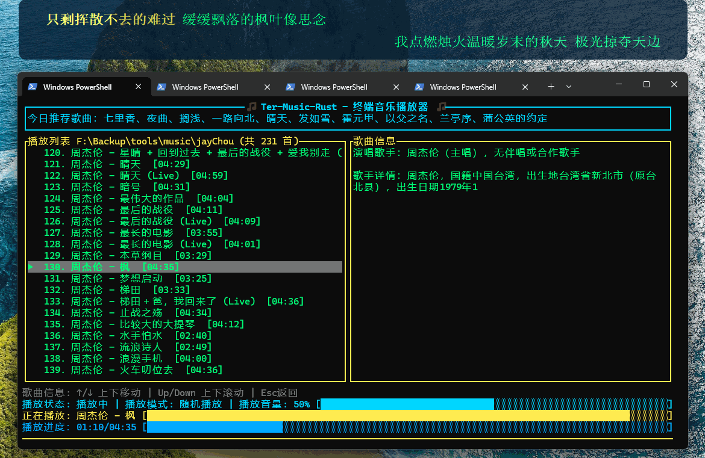
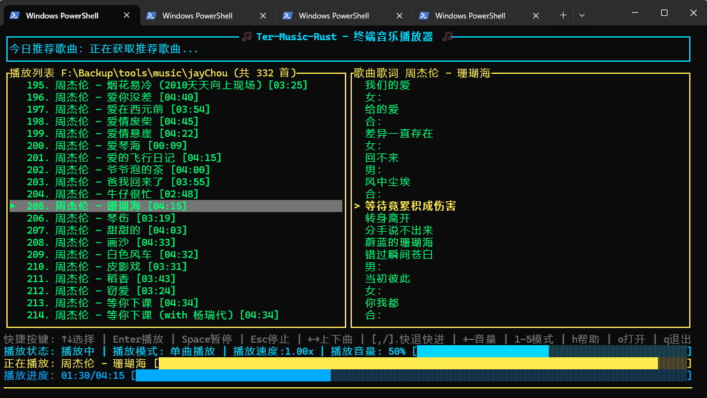
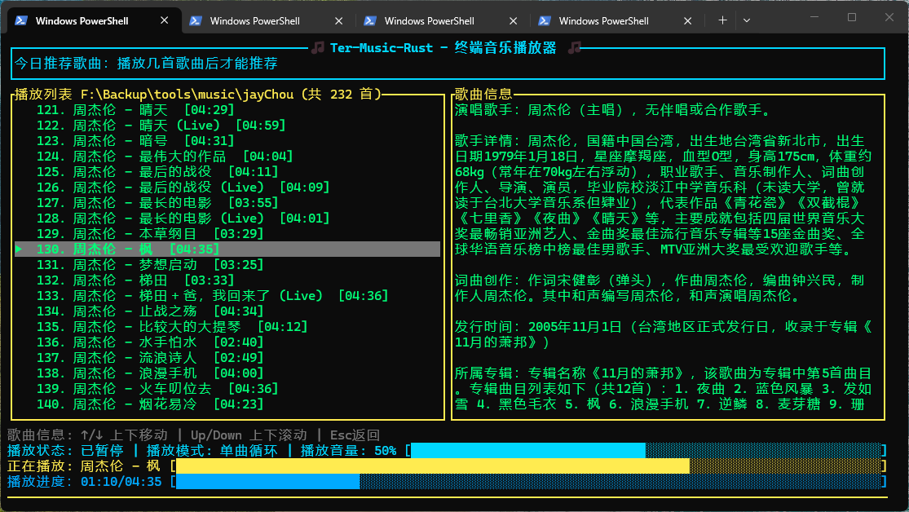

<div align="center">

[简体中文](README.md) | [繁體中文](README_TC.md) | [English](README_EN.md) | [日本語](README_JP.md) | [한국어](README_KR.md) | [Русский](README_RU.md) | [Français](README_FR.md) | [Deutsch](README_DE.md) | [Español](README_ES.md) | [Italiano](README_IT.md) | [Português](README_PT.md)

# 🎵 Ter-Music-Rust - Terminal-Musikplayer 🎵

</div>

Ein schlanker und praktischer Terminal-Musikplayer in Rust mit lokaler/online Suche und Download von Songs, automatischem Herunterladen und Anzeigen von Liedtexten, Kommentaransicht sowie Sprach- und Theme-Umschaltung. Unterstützt Windows, Linux und MacOS.









## ✨ Funktionen

### 🎵 Audiowiedergabe
- **10 Audioformate unterstützt**: MP3, WAV, FLAC, OGG, OGA, Opus, M4A, AAC, AIFF, APE
- **Wiedergabesteuerung**: Wiedergabe/Pause/Stopp, vorheriger/nächster Titel
- **Vorspulen**: Schnelles Vorspulen um 5s / 10s
- **Fortschrittsbalken-Vorspulen**: Klick auf den Fortschrittsbalken für präzises Springen
- **Lautstärkeregelung**: Echtzeit-Einstellung von 0-100, Klick auf die Lautstärkeleiste zum Setzen
- **Empfohlene Songs**: `r` drücken, um heutige Empfehlungen zu aktivieren, und `a`, um Empfehlungen aus natürlichsprachigen Wünschen zu erzeugen
- **Zuletzt gespielt**: `b` drücken, um die Liste mit Titel, Wiedergabezeit und Anzahl der Wiedergaben anzuzeigen
- **M3U Import/Export**: `x` zum Importieren einer M3U-Playlist und `e` zum Exportieren der aktuellen Playlist drücken
- **Suchverlauf**: Zeigt den Verlauf bei leerer Suche, speichert bis zu 20 Einträge automatisch
- **Wiedergabegeschwindigkeit**: Unterstützt 50%-200%, mit `{`/`}` in 25%-Schritten einstellbar
- **A-B Schleife**: `;` setzt Punkt A, `'` setzt Punkt B oder schaltet die Schleife um, `、` löscht sie

### 🔄 Wiedergabemodi
| Taste | Modus | Beschreibung |
|------|------|------|
| `1` | Einzeltitelwiedergabe | Nach Abschluss des aktuellen Titels stoppen |
| `2` | Einzeltitelwiederholung | Aktuellen Titel wiederholen |
| `3` | Fortlaufende Wiedergabe | In Reihenfolge abspielen, am Ende stoppen |
| `4` | Listenwiederholung | Gesamte Wiedergabeliste wiederholen |
| `5` | Zufallswiedergabe | Zufällige Titelauswahl |

### 📜 Liedtext-System
- **Lokales Laden von Liedtexten**: Automatisches Finden passender `.lrc`-Dateien
- **Liedtext-Kodierungserkennung**: Automatische Erkennung von UTF-8 / GBK
- **Automatischer Online-Download**: Asynchroner Hintergrund-Download bei fehlenden lokalen Liedtexten
- **Scrollende Hervorhebung**: Aktuelle Zeile wird mit `>` hervorgehoben, automatisches zentriertes Scrollen
- **Liedtext-Positionssprung**: Ziehen des Liedtextbereichs oder Mausrad zum Springen nach Liedtext-Zeitstempel
- **Liedtext-Übersetzung**: `y` drücken, um Übersetzungen mit Streaming-Übersetzung und Übersetzungs-Cache anzuzeigen
- **Zweisprachige Lyrics**: Original und Übersetzung gemeinsam in Hauptansicht und Desktop-Lyrics anzeigen
- **Desktop-Lyrics**: `z` schaltet schwebende Lyrics um, mit vertikalem, horizontalem und Karaoke-Modus
- **Liedtext-Kalibrierung**: `u` drücken, um den Liedtext-Zeitoffset anzupassen und zu speichern

### 🔍 Suche
- **Lokale Suche**: `s` drücken, um Songs im aktuellen Musikverzeichnis zu suchen
- **Online-Suche**: `n` drücken, um Online-Songs nach Schlüsselwort zu suchen
- **Juhe-Suche**: `j` drücken zum Eingang. Suche nach Juhe-Songs basierend auf Schlüsselwortübereinstimmung.
- **Wiedergabelisten-Suche**: `p` drücken zum Eingang. Suche nach Online-Wiedergabelisten basierend auf Schlüsselwortübereinstimmung.
- **Seitenwechsel**: `PgUp` / `PgDn` für weitere Ergebnisse
- **Online-Download**: `Enter` auf ausgewähltem Online-Ergebnis drücken, um in das aktuelle Musikverzeichnis herunterzuladen (mit Fortschrittsanzeige)

### 🤖 Song-Informationen
- **Intelligente Abfrage**: `i` drücken, um detaillierte Song-Informationen abzufragen, unterstützt jede OpenAI-kompatible API
- **Streaming-Ausgabe**: Ergebnisse werden Zeichen für Zeichen angezeigt, kein Warten auf vollständige Generierung erforderlich
- **Umfangreiche Informationen**: Abdeckt 13 Kategorien einschließlich Künstlerdetails, Songwriting, Album-Titelliste, kreativer Hintergrund, Liedtextbedeutung, Musikstil, Anekdoten und mehr
- **Mehrsprachige Unterstützung**: Antwortsprache folgt der Einstellung der Benutzeroberflächensprache (SC/TC/EN/JP/KR)
- **Benutzerdefinierte API**: `k` drücken, um API-Basis-URL, API-Schlüssel und Modellnamen in 3 Schritten zu konfigurieren — unterstützt DeepSeek, OpenRouter, AIHubMix und jeden OpenAI-kompatiblen Endpunkt
- **Kostenloser Fallback**: Verwendet automatisch das kostenlose Modell von OpenRouter (minimax/minimax-m2.5:free), wenn kein API-Schlüssel konfiguriert ist

### ⭐ Favoriten
- **Favoriten hinzufügen/entfernen**: `f` drücken, um den Favoritenstatus des aktuellen Titels umzuschalten
- **Favoritenliste**: `v` drücken, um Favoriten anzuzeigen (mit `*`-Markierung)
- **Verzeichnisübergreifende Wiedergabe**: Automatischer Verzeichniswechsel, wenn sich ein Favorit außerhalb des aktuellen Verzeichnisses befindet
- **Favorit löschen**: `d` in der Favoritenliste drücken

### 💬 Kommentare
- **Song-Kommentare**: `c` drücken, um Kommentare zum aktuellen Song anzuzeigen
- **Kommentarzusammenfassung**: Auf der Kommentarseite erneut `c` drücken, damit die KI Resonanzpunkte, emotionale Stimmung, repräsentative Meinungen, Schlüsselwörter und Unterschiede zusammenfasst
- **Kommentardetails**: `Enter` drücken, um zwischen Listen-/Detailansicht zu wechseln (Volltext in Detailansicht)
- **Antwortanzeige**: Zeigt den Originaltext des beantworteten Kommentars, den Spitznamen und die Zeit an
- **Kommentar-Seitenwechsel**: `PgUp` / `PgDn`, 20 Kommentare pro Seite
- **Hintergrundladen**: Kommentare werden in Hintergrund-Threads abgerufen, ohne die Benutzeroberfläche zu blockieren

### 📂 Verzeichnisverwaltung
- **Musikverzeichnis wählen**: `o` drücken, um den Ordnerauswahl-Dialog zu öffnen (Wiedergabe startet automatisch nach erster erfolgreicher Öffnung)
- **Verzeichnisverlauf öffnen**: `m` drücken, um Verzeichnisse anzuzeigen und schnell zu wechseln
- **Aktuelles Verzeichnis-Marker**: `>>` zeigt das aktuell aktive Verzeichnis an
- **Verlaufseintrag löschen**: `d` in der Verlaufsansicht drücken

### 🌐 Mehrsprachige Benutzeroberfläche
Unterstützt 11 UI-Sprachen (Wechsel mit `l`):

| Sprache | Konfigurationswert |
|------|--------|
| Vereinfachtes Chinesisch | `sc` |
| Traditionelles Chinesisch | `tc` |
| Englisch | `en` |
| Japanisch | `ja` |
| Koreanisch | `ko` |
| Russisch | `ru` |
| Französisch | `fr` |
| Deutsch | `de` |
| Spanisch | `es` |
| Italienisch | `it` |
| Portugiesisch | `pt` |

### 🎨 Mehrthema-Benutzeroberfläche
Unterstützt 4 Themen (Wechsel mit `t`):

| Thema | Stil |
|------|------|
| Neon | Neontöne |
| Sunset | Warmes Sonnenuntergangsgold |
| Ocean | Tiefes Ozeanblau |
| GrayWhite | Konsolenartige Graustufen |

### 🖱️ Maus-Interaktion
- **Wiedergabelisten-Klick**: Klick zum direkten Abspielen eines Songs
- **Fortschrittsbalken-Klick**: Zu einer bestimmten Position springen
- **Lautstärkeleisten-Klick**: Lautstärke anpassen
- **Liedtext-Ziehen**: Linksziehen zum Springen nach Liedtext-Zeitstempel
- **Liedtext-Mausrad**: Hoch/Runter scrollen zur vorherigen/nächsten Liedtextzeile springen
- **Suchergebnis-Klick**: Lokale Suche — Klick zum Abspielen, Online-Suche — Klick zum Herunterladen
- **Kommentar-Klick**: Klick zum Öffnen der Details

### 📊 Wellenform-Visualisierung
- Dynamische Wellenformbalken basierend auf dem tatsächlichen RMS-Volumen während der Wiedergabe
- EMA-Glättung für weichere Darstellung
- Wellenform friert bei Pause ein

### ⚙️ Persistente Konfiguration
Unter Windows wird die Konfiguration in `%USERPROFILE%/AppData/Roaming/ter-music-rust/config.json` gespeichert. Unter Linux und macOS wird sie in `XDG_CONFIG_HOME/ter-music-rust/config.json` oder `~/.config/ter-music-rust/config.json` gespeichert und automatisch gespeichert/wiederhergestellt:

| Konfigurationselement | Beschreibung |
|--------|------|
| `music_directory` | Zuletzt geöffnetes Musikverzeichnis |
| `play_mode` | Wiedergabemodus |
| `current_index` | Index des zuletzt abgespielten Songs (Wiedergabe fortsetzen) |
| `volume` | Lautstärke (0-100) |
| `favorites` | Favoritenliste |
| `dir_history` | Verzeichnisverlauf |
| `search_history` | Suchverlauf (maximal 20 Einträge) |
| `api_key` | API-Schlüssel (für Song-Info-Abfrage, abwärtskompatibel mit `deepseek_api_key`) |
| `api_base_url` | API-Basis-URL (Standard: `https://api.deepseek.com/`) |
| `api_model` | AI-Modellname (Standard: `deepseek-v4-flash`) |
| `github_token` | GitHub-Token (verwendet für Song-Info-Diskussionen; leer lassen für Standard-Token) |
| `recommand` | Empfohlene Songs des Tages umschalten (Standard `false`) |
| `theme` | Themenname |
| `language` | UI-Sprache (`sc` / `tc` / `en` / `ja` / `ko` / `ru` / `fr` / `de` / `es` / `it` / `pt`) |
| `lyrics_visible` | Ob Desktop-Lyrics angezeigt werden (Standard `false`) |
| `lyrics_position` | Position der Desktop-Lyrics (`bottom` / `top`, Standard `bottom`) |
| `lyrics_scroll` | Scrollmodus der Desktop-Lyrics (`vertical` / `horizontal` / `karaoke`, Standard `vertical`) |
| `lyrics_alpha` | Hintergrundtransparenz der Desktop-Lyrics 10-100 (Standard 70) |
| `lyrics_x` | X-Koordinate des Desktop-Lyrics-Fensters (-1 bedeutet automatische Berechnung) |
| `lyrics_y` | Y-Koordinate des Desktop-Lyrics-Fensters (-1 bedeutet automatische Berechnung) |
| `lyrics_offset` | Liedtext-Zeitoffset in Sekunden (für Lyrics-Kalibrierung) |

**Auto-Speichern-Auslöser**: Titelwechsel, Themawechsel, Sprachwechsel, Favoritenänderung, Aktualisierung des Suchverlaufs, Änderung der Desktop-Lyrics-Steuerung, alle 30 Sekunden und beim Beenden (einschließlich Strg+C)

---

## 🚀 Schnellstart

### 1. Direkte Installation（empfohlen）

Wenn Rust bereits installiert ist, können Sie direkt von crates.io installieren und ausführen:

```powershell
cargo install ter-music-rust
ter-music-rust
```

### 2. Rust installieren（optional）

```powershell
# Methode 1: winget (empfohlen)
winget install Rustlang.Rustup

# Methode 2: Offizieller Installer
# https://rustup.rs/ besuchen und installieren
```

Installation überprüfen:

```powershell
rustc --version
cargo --version
```

### 3. Projekt erstellen

```powershell
# Repository klonen
git clone https://github.com/xxgg121/ter-music-rust.git
cd ter-music-rust

# Methode 1: Build-Skript (empfohlen)
build-win.bat

# Methode 2: Cargo
cargo build --release
```

### 4. Ausführen

```powershell
# Methode 1: cargo run
cargo run --release

# Methode 2: Ausführbare Datei direkt starten
.\target\release\ter-music-rust.exe

# Methode 3: Musikverzeichnis angeben
.\target\release\ter-music-rust.exe -o d:\Music
cargo run --release -- -o d:\Music
```

**Verzeichnis-Ladepriorität**: Kommandozeile `-o` > Konfigurationsdatei > Ordnerauswahl-Dialog

---

## 🎮 Tastenkombinationen

### Tasten der Hauptansicht

| Taste | Aktion |
|------|------|
| `↑/↓` | Song auswählen |
| `Enter` | Ausgewählten Song abspielen |
| `Leertaste` | Wiedergabe/Pause |
| `Esc` | Wiedergabe stoppen (in Kommentaransicht: zurück zu Liedtexten) |
| `←/→` | Vorheriger/Nächster Song |
| `[` | 5s zurückspulen |
| `]` | 5s vorspulen |
| `,` | 10s zurückspulen |
| `.` | 10s vorspulen |
| `+/-` | Lautstärke hoch/runter (Schritt 5) |
| `{/}` | Wiedergabegeschwindigkeit erhöhen/verringern (Schritt 25%) |
| `;` | A-B Schleifenstartpunkt A setzen |
| `'` | A-B Schleifenendpunkt B setzen oder Schleife umschalten |
| `、` | A-B Schleife löschen |
| `1-5` | Wiedergabemodus wechseln |
| `o` | Musikverzeichnis öffnen |
| `s` | Lokale Songs suchen |
| `n` | Online-Songs suchen |
| `j` | Aggregierte Songs suchen |
| `p` | Online-Wiedergabelisten suchen |
| `i` | Song-Informationen anzeigen |
| `a` | Empfohlene Songs anfordern |
| `Shift+A` | Smart-Playlist-Empfehlung |
| `Shift+S` | Empfehlung ähnlicher Songs |
| `f` | Favorit hinzufügen/entfernen |
| `v` | Favoriten anzeigen |
| `m` | Musikverzeichnis anzeigen |
| `h` | Hilfe anzeigen |
| `c` | Song-Kommentare anzeigen |
| `l` | UI-Sprache wechseln |
| `t` | Thema wechseln |
| `k` | API-Endpunkt konfigurieren |
| `g` | GitHub-Token konfigurieren |
| `z` | Desktop-Lyrics ein/aus |
| `r` | Empfohlene Songs ein/aus |
| `y` | Liedübersetzung / Bilinguales Anzeigen umschalten |
| `b` | Zuletzt gespielte Liste öffnen |
| `w` | Smart-Playlist-Historie öffnen |
| `x` | M3U-Playlist importieren |
| `e` | M3U-Wiedergabeliste exportieren |
| `u` | In den Lyrics-Zeitkalibrierungsmodus wechseln |
| `q` | Musikprogramm beenden |

### Tasten der Songsuche

| Taste | Aktion |
|------|------|
| Zeicheneingabe | Suchbegriff eingeben |
| `Rücktaste` | Zeichen löschen |
| `Enter` | Suchen/Abspielen/Herunterladen |
| `↑/↓` | Ergebnis auswählen |
| `PgUp/PgDn` | Seite hoch/runter (Online-Suche) |
| `s/n/j` | Lokale/Online/aggregierte Suche wechseln |
| `Esc` | Suche beenden |

### Tasten der Favoritenliste

| Taste | Aktion |
|------|------|
| `↑/↓` | Song auswählen |
| `Enter` | Ausgewählten Song abspielen |
| `d` | Favorit löschen |
| `Esc` | Zurück zur Wiedergabeliste |

### Tasten des Musikverzeichnisses

| Taste | Aktion |
|------|------|
| `↑/↓` | Verzeichnis auswählen |
| `Enter` | Zum ausgewählten Verzeichnis wechseln |
| `d` | Eintrag löschen |
| `Esc` | Zurück zur Wiedergabeliste |

### Tasten der Song-Kommentare

| Taste | Aktion |
|------|------|
| `↑/↓` | Kommentar auswählen |
| `Enter` | Listen-/Detailansicht wechseln |
| `c` | KI-Kommentarzusammenfassung |
| `PgUp/PgDn` | Seite hoch/runter |
| `Esc` | Zurück zur Liedtextansicht |

### Tasten der Song-Informationen

| Taste | Aktion |
|------|------|
| `↑/↓` | Song-Info scrollen |
| `i` | Song-Info erneut abfragen |
| `Esc` | Zurück zur Liedtextansicht |

### Tasten der Smart-Playlist-Empfehlung

| Taste | Aktion |
|------|------|
| Zeicheneingabe | Smart-Playlist-Beschreibung / Thema eingeben |
| Voreinstellungen | Voreingestelltes Thema anklicken, um schnell Empfehlungen zu erhalten |
| `Rücktaste` | Zeichen löschen |
| `Enter` | Empfehlungsliste generieren / Ausgewählten Song abspielen |
| `↑/↓` | Empfohlenen Song auswählen |
| Mausrad | Songliste nach oben/unten scrollen |
| `d` | Aktuellen Smart-Playlist-Verlaufseintrag löschen |
| `Esc` | Zurück zur Wiedergabeliste |

### Tasten der Smart-Playlist-Historie

| Taste | Aktion |
|------|------|
| `↑/↓` | Historische Smart-Playlist auswählen |
| `Enter` | Ausgewählte Historien-Playlist erneut öffnen und abspielen |
| `PgUp/PgDn` | Seite hoch/runter |
| `d` | Ausgewählten Verlaufseintrag löschen |
| `Esc` | Zurück zur Wiedergabeliste |

### Tasten der zuletzt gespielten Titel

| Taste | Aktion |
|------|------|
| `↑/↓` | Zuletzt gespielten Song auswählen |
| `Enter` | Ausgewählten Song abspielen |
| `PgUp/PgDn` | Seite hoch/runter |
| `d` | Verlaufseintrag der letzten Wiedergabe löschen |
| `Esc` | Zurück zur Wiedergabeliste |

### Tasten der Hilfe


| Taste | Aktion |
|------|------|
| `↑/↓` | Hilfeinhalt scrollen |
| `Esc` | Zurück zur Liedtextansicht |

---

## 📦 Installation & Build

### Systemanforderungen

- **Betriebssystem**: Windows 10/11
- **Rust**: 1.70+
- **Terminal**: Windows Terminal (empfohlen) / CMD / PowerShell
- **Fenstergröße**: 80×25 oder größer empfohlen

### Option 1: MSVC-Toolchain (beste Kompatibilität, größere Dateigröße)

```powershell
# 1. Rust installieren
winget install Rustlang.Rustup

# 2. Build-Tools installieren
winget install Microsoft.VisualStudio.2022.BuildTools
# Installer ausführen -> „Desktop-Entwicklung mit C++" auswählen -> installieren

# 3. Terminal neu starten und erstellen
cargo build --release
```

### Option 2: GNU-Toolchain (empfohlen, leichtgewichtig ~300 MB)

```powershell
# 1. Rust installieren
winget install Rustlang.Rustup

# 2. MSYS2 installieren
winget install MSYS2.MSYS2
# Im MSYS2-Terminal ausführen:
pacman -Syu
pacman -S mingw-w64-x86_64-toolchain

# 3. PATH hinzufügen (PowerShell als Administrator)
[Environment]::SetEnvironmentVariable("Path", $env:Path + ";C:\msys64\mingw64\bin", "Machine")

# 4. Toolchain wechseln und erstellen
rustup default stable-x86_64-pc-windows-gnu
cargo build --release
```

> Programme, die mit der GNU-Toolchain erstellt wurden, benötigen möglicherweise diese DLLs im Verzeichnis der ausführbaren Datei:
> `libgcc_s_seh-1.dll`, `libstdc++-6.dll`, `libwinpthread-1.dll`

### Option 3: Cross-Compiling für Linux auf Windows

Verwenden Sie `cargo-zigbuild` + `zig` als Linker. Keine Linux-VM/Installation erforderlich.

```powershell
# 1. Zig installieren (eine Option wählen)
# A: via pip (empfohlen)
pip install ziglang

# B: via MSYS2
pacman -S mingw-w64-x86_64-zig

# C: Manueller Download
# https://ziglang.org/download/ besuchen, entpacken und zum PATH hinzufügen

# 2. cargo-zigbuild installieren
cargo install cargo-zigbuild

# 3. Linux-Target hinzufügen
rustup target add x86_64-unknown-linux-gnu

# 4. Linux-Sysroot vorbereiten (ALSA-Header/Bibliotheken)
# Das Projekt enthält bereits linux-sysroot/
# Für manuelle Vorbereitung von Debian/Ubuntu kopieren:
#   /usr/include/alsa/ -> linux-sysroot/usr/include/alsa/
#   /usr/lib/x86_64-linux-gnu/libasound.so* -> linux-sysroot/usr/lib/x86_64-linux-gnu/

# 5. Erstellen
build-linux.bat

# Oder manuell ausführen:
cargo zigbuild --release --target x86_64-unknown-linux-gnu.2.34
```

**Ausgabe**: `target/x86_64-unknown-linux-gnu/release/ter-music-rust`

**Auf Linux bereitstellen**:

```bash
# 1. Auf Linux-Host kopieren
scp ter-music-rust user@linux-host:~/

# 2. Ausführbar machen
chmod +x ter-music-rust

# 3. ALSA-Runtime installieren
sudo apt install libasound2

# 4. Ausführen
./ter-music-rust -o /path/to/music
```

> `build-linux.bat` konfiguriert automatisch `PKG_CONFIG_PATH`, `PKG_CONFIG_ALLOW_CROSS`, `RUSTFLAGS` usw.
> Im Target `x86_64-unknown-linux-gnu.2.34` gibt `.2.34` die minimale glibc-Version für bessere Kompatibilität mit älteren Linux-Systemen an.

### Linux-Verpackung (DEB / RPM)

Wenn Sie auf Linux erstellen/verpacken, verwenden Sie:

```bash
# 1) RPM
./build-rpm.sh

# Debuginfo-RPM generieren (optional)
./build-rpm.sh --with-debuginfo

# 2) DEB
./build-deb.sh

# DEB mit Debug-Symbolen generieren (optional)
./build-deb.sh --with-debuginfo

# Quellpaket kompatibel mit dpkg-source generieren (.dsc/.orig.tar/.debian.tar)
./build-deb.sh --with-source

# Debuginfo + Quellpaket generieren
./build-deb.sh --with-debuginfo --with-source
```

Standard-Ausgabeverzeichnisse:
- `dist/rpm/`: RPM / SRPM
- `dist/deb/`: DEB / Quellpakete

> Skripte lesen `name` und `version` aus `Cargo.toml`, um Paketdateien automatisch zu benennen.

### Option 4: Cross-Compiling für MacOS auf Windows

Verwenden Sie `cargo-zigbuild` + `zig` + MacOS SDK. Audio auf MacOS verwendet CoreAudio und erfordert SDK-Header.

**Voraussetzungen:**

```powershell
# 1. Zig installieren (wie bei Linux-Cross-Compiling)
pip install ziglang

# 2. cargo-zigbuild installieren
cargo install cargo-zigbuild

# 3. LLVM/Clang installieren (stellt libclang.dll für bindgen bereit)
# A: via MSYS2
pacman -S mingw-w64-x86_64-clang

# B: Offizielles LLVM
winget install LLVM.LLVM

# 4. MacOS-Targets hinzufügen
rustup target add x86_64-apple-darwin aarch64-apple-darwin
```

**MacOS SDK vorbereiten:**

Entpacken Sie `MacOSX13.3.sdk.tar.xz` in `macos-sysroot`.
Das Projekt enthält bereits `macos-sysroot/` (heruntergeladen von [macosx-sdks](https://github.com/joseluisq/macosx-sdks)).

Erneut herunterladen:

```powershell
# A: Vorgepacktes SDK von GitHub herunterladen (empfohlen, ~56 MB)
# Spiegel: https://ghfast.top/https://github.com/joseluisq/macosx-sdks/releases/download/13.3/MacOSX13.3.sdk.tar.xz
curl -L -o MacOSX13.3.sdk.tar.xz https://github.com/joseluisq/macosx-sdks/releases/download/13.3/MacOSX13.3.sdk.tar.xz
mkdir macos-sysroot
tar -xf MacOSX13.3.sdk.tar.xz -C macos-sysroot --strip-components=1
del MacOSX13.3.sdk.tar.xz

# B: Von einem MacOS-System kopieren
scp -r mac:/Library/Developer/CommandLineTools/SDKs/MacOSX.sdk ./macos-sysroot
```

> SDK-Quelle: https://github.com/joseluisq/macosx-sdks
> Enthält Header für CoreAudio, AudioToolbox, AudioUnit, CoreMIDI, OpenAL, IOKit usw.

**Erstellen:**

```powershell
# Build-Skript verwenden (setzt automatisch alle Umgebungsvariablen)
build-mac.bat

# Oder manuell:
$env:LIBCLANG_PATH = "C:\msys64\mingw64\bin"      # Verzeichnis mit libclang.dll
$env:COREAUDIO_SDK_PATH = "./macos-sysroot"         # MacOS-SDK-Pfad (Schrägstriche)
$env:SDKROOT = "./macos-sysroot"                    # Vom Zig-Linker zum Auffinden von Systembibliotheken benötigt
$FW = "./macos-sysroot/System/Library/Frameworks"
$env:BINDGEN_EXTRA_CLANG_ARGS = "--target=x86_64-apple-darwin -isysroot ./macos-sysroot -F $FW -iframework $FW -I ./macos-sysroot/usr/include"
cargo zigbuild --release --target x86_64-apple-darwin   # Intel Mac
# Für Apple Silicon x86_64 durch aarch64 ersetzen
cargo zigbuild --release --target aarch64-apple-darwin  # Apple Silicon
```

**Ausgaben:**
- `target/x86_64-apple-darwin/release/ter-music-rust` — Intel Mac
- `target/aarch64-apple-darwin/release/ter-music-rust` — Apple Silicon (M1/M2/M3/M4)

**Auf MacOS bereitstellen**:

```bash
# 1. Auf MacOS-Host kopieren
scp ter-music-rust user@mac-host:~/

# 2. Ausführbar machen
chmod +x ter-music-rust

# 3. Ausführung unbekannter Quellen erlauben
xattr -cr ter-music-rust

# 4. Ausführen (keine zusätzlichen Audiobibliotheken erforderlich)
./ter-music-rust -o /path/to/music
```

> Hinweis: MacOS-Cross-Compiling erfordert MacOS-SDK-Header; dieses Projekt enthält bereits `macos-sysroot/`.
> Außerdem wird `libclang.dll` benötigt (über MSYS2 oder LLVM installieren).

### Toolchain wechseln

```powershell
# Aktuelle Toolchain anzeigen
rustup show

# Zu MSVC wechseln
rustup default stable-x86_64-pc-windows-msvc

# Zu GNU wechseln
rustup default stable-x86_64-pc-windows-gnu
```

### Cargo-Spiegel in China (schnellere Downloads)

Erstellen oder bearbeiten Sie `~/.cargo/config`:

```toml
[source.crates-io]
replace-with = 'ustc'

[source.ustc]
registry = "https://mirrors.ustc.edu.cn/crates.io-index"
```

---

## 🛠️ Projektstruktur

```text
src/
├── main.rs       # Einstiegspunkt (Argument-Parsing, Initialisierung, Konfigurationswiederherstellung/-speicherung)
├── defs.rs       # Gemeinsame Definitionen (PlayMode/PlayState Enums, MusicFile/Playlist Strukturen)
├── langs.rs      # Sprachpakete (zentralisiertes Management der Übersetzungstexte in 11 Sprachen, globaler Sprachzugriff)
├── audio.rs      # Audiosteuerung (rodio Wrapper, Wiedergabe/Pause/Suchen/Lautstärke/Fortschritt)
├── analyzer.rs   # Audioanalysator (Echtzeit-RMS-Lautstärke, EMA-Glättung, Wellenform-Rendering)
├── playlist.rs   # Playlist-Verwaltung (Verzeichnis-Scan, parallele Dauerladung, Ordnerauswahl)
├── lyrics.rs     # Lyrics-Parsing (LRC Format, lokale Suche, Kodierungserkennung, Hintergrund-Download)
├── search.rs     # Online-Suche/Download (Kuwo + Kugou + NetEase Suche, Download, Kommentar-Abruf, Song-Info-Streaming-Abfrage)
├── config.rs     # Konfigurationsverwaltung (JSON-Serialisierung, persistente Konfigurationselemente)
├── desktop_lyrics.rs # Desktop-Lyrics-Floating-Window (Windows API/Linux Child-Prozess, Transparenz/Position/Ziehen/Shortcuts)
├── ui.rs         # Benutzeroberfläche (Ratatui Framework, Terminal-Rendering, Event-Handling, Multiview-Modus, Theme/Sprache-System)
└── ui/
    ├── input.rs      # Eingabe-Verarbeitung
    ├── render.rs     # Rendering-Logik
    ├── layout.rs     # Layout-Verwaltung
    ├── theme.rs      # Theme-System
    ├── mouse.rs      # Maus-Interaktion
    ├── terminal.rs   # Terminal-Verwaltung
    ├── format.rs     # Formatierungs-Tools
    └── view_model.rs # View-Modell
```

### Technologie-Stack

| Abhängigkeit | Version | Zweck |
|------|------|------|
| [rodio](https://github.com/RustAudio/rodio) | 0.19 | Audio-Dekodierung und Wiedergabe (reines Rust) |
| [crossterm](https://github.com/crossterm-rs/crossterm) | 0.28 | Terminal-UI-Steuerung |
| [reqwest](https://github.com/seanmonstar/reqwest) | 0.12 | HTTP-Anfragen |
| [serde](https://github.com/serde-rs/serde) + serde_json | 1.0 | JSON-Serialisierung |
| [rayon](https://github.com/rayon-rs/rayon) | 1.10 | Paralleles Laden der Audiodauer |
| [encoding_rs](https://github.com/hsivonen/encoding_rs) | 0.8 | GBK-Liedtext-Dekodierung |
| [walkdir](https://github.com/BurntSushi/walkdir) | 2.5 | Rekursive Verzeichnisscan |
| [rand](https://github.com/rust-random/rand) | 0.8 | Zufallswiedergabemodus |
| [unicode-width](https://github.com/unicode-rs/unicode-width) | 0.2 | CJK-Anzeigebreitenberechnung |
| [chrono](https://github.com/chronotope/chrono) | 0.4 | Kommentarzeitformatierung |
| [ctrlc](https://github.com/Detegr/rust-ctrlc) | 3.4 | Strg+C-Signalverarbeitung |
| [md5](https://github.com/johannhof/md5) | 0.7 | Kugou-Music-API-MD5-Signatur |
| [winapi](https://github.com/retep998/winapi-rs) | 0.3 | Windows-Konsole UTF-8-Unterstützung |

### Release-Build-Optimierung

```toml
[profile.release]
opt-level = 3       # höchste Optimierungsstufe
lto = true          # Link-Time-Optimierung
codegen-units = 1   # einzelne Codegen-Einheit für bessere Optimierung
strip = true        # Debug-Symbole entfernen
```

---

## Vergleich zwischen Rust und C-Version

| Eigenschaft | Rust-Version | C-Version |
|------|-----------|--------|
| Installationsgröße | ~200 MB (Rust) / ~300 MB (GNU) | ~7 GB (Visual Studio) |
| Einrichtungszeit | ~5 Minuten | ~1 Stunde |
| Kompiliergeschwindigkeit | ⚡ Schnell | 🐢 Langsamer |
| Abhängigkeitsverwaltung | ✅ Automatisch via Cargo | ❌ Manuelle Einrichtung |
| Speichersicherheit | ✅ Kompilierzeit-Garantien | ⚠️ Manuelle Verwaltung erforderlich |
| Cross-Plattform | ✅ Vollständig cross-plattform | ⚠️ Code-Änderungen erforderlich |
| Größe der ausführbaren Datei | ~2 MB | ~500 KB |
| Speicherverbrauch | ~15-20 MB | ~10 MB |
| CPU-Auslastung | < 1% | < 1% |

---

## 📊 Leistung

| Metrik | Wert |
|------|------|
| UI-Aktualisierungsintervall | 50ms |
| Tastenreaktion | < 50ms |
| Liedtext-Download | Hintergrund, nicht blockierend |
| Verzeichnisscan | Paralleles Dauerladen, 2-4x Beschleunigung |
| Startzeit | < 100ms |
| Speicherverbrauch | ~15-20 MB |

---

## 🐛 Fehlerbehebung

### Build-Fehler

```powershell
# Rust aktualisieren
rustup update

# Bereinigen und neu erstellen
cargo clean
cargo build --release
```

### `link.exe nicht gefunden`

Visual Studio Build Tools installieren (siehe Option 1 oben).

### `dlltool.exe nicht gefunden`

Vollständige MinGW-w64-Toolchain installieren (siehe Option 2 oben).

### Fehlende Runtime-DLLs (GNU-Toolchain)

```powershell
Copy-Item "C:\msys64\mingw64\bin\libgcc_s_seh-1.dll" -Destination ".\target\release\"
Copy-Item "C:\msys64\mingw64\bin\libstdc++-6.dll" -Destination ".\target\release\"
Copy-Item "C:\msys64\mingw64\bin\libwinpthread-1.dll" -Destination ".\target\release\"
```

### Kein Audiogerät gefunden

1. Stellen Sie sicher, dass das System-Audiogerät funktioniert
2. Überprüfen Sie die Windows-Lautstärkeeinstellungen
3. Versuchen Sie, einen Systemtestton abzuspielen

### UI-Rendering-Probleme

- Stellen Sie sicher, dass die Terminalfenstergröße mindestens 80×25 beträgt
- Verwenden Sie Windows Terminal für das beste Erlebnis
- Stellen Sie in CMD sicher, dass die ausgewählte Schriftart bei Bedarf CJK unterstützt

### Online-Suche / Liedtext-Download schlägt fehl

- Überprüfen Sie Ihre Netzwerkverbindung
- Einige Songs benötigen möglicherweise VIP-Zugang oder wurden entfernt
- Liedtextdatei muss im gültigen Standard-LRC-Format vorliegen

### Song-Info-Abfrage schlägt fehl

- Wenn kein API-Schlüssel konfiguriert ist, wird automatisch das kostenlose Modell von OpenRouter verwendet — keine manuelle Einrichtung erforderlich
- Um einen benutzerdefinierten Endpunkt zu verwenden, drücken Sie `k` und geben Sie nacheinander API-Basis-URL, API-Schlüssel und Modellnamen ein
- Unterstützt jede OpenAI-kompatible API (DeepSeek, OpenRouter, AIHubMix usw.)
- Überprüfen Sie die Netzwerkverbindung zum entsprechenden API-Dienst

### Langsamer erster Build

Der erste Build lädt und kompiliert alle Abhängigkeiten herunter; dies ist erwartet. Spätere Builds sind deutlich schneller.

### Downloads
[ter-music-rust-win.zip](https://storage.deepin.org/thread/202605191650473525_ter-music-rust-win.zip "附件(Attached)")
[ter-music-rust-mac.zip](https://storage.deepin.org/thread/20260519165110865_ter-music-rust-mac.zip "附件(Attached)")
[ter-music-rust_deb.zip](https://storage.deepin.org/thread/202605191653509387_ter-music-rust_deb.zip "附件(Attached)")

---

## 📝 Änderungsprotokoll

## Version 2.2.0 (2026-05-20)

### 🎉 Neue Funktionen
- ✨ **Intelligente Playlist-Empfehlung**: Drücken Sie `Shift+A`, um in den Eingabemodus für intelligente Playlists zu wechseln. Nach Eingabe einer Beschreibung oder Klick auf eine Voreinstellung empfiehlt das Modell im Streaming-Modus 20~30 thematische Titel und fügt sie nacheinander der intelligenten Playlist-Empfehlungsliste hinzu; die Wiedergabe startet automatisch, sobald der erste Titel analysiert ist. Intelligente Playlists können als Verlauf gespeichert und mit `W` erneut geöffnet werden.
- ✨ **Heutige empfohlene Titel**: Die heutigen Empfehlungen werden jetzt im Streaming-Verfahren ausgegeben. Jeder vom Modell zurückgegebene Titel wird sofort oben im Bereich „Heutige empfohlene Titel" hinzugefügt, sodass nicht mehr auf die vollständige Generierung gewartet werden muss. Der Hinweis „Empfohlene Titel werden geladen..." wird ausgeblendet, sobald der erste Titel erscheint. Jeweils 5~10 Titel werden empfohlen, und das Ergebnis enthält keine Empfehlungsgründe oder überflüssigen Felder mehr.
- ✨ **Empfehlung ähnlicher Titel**: Drücken Sie während der Wiedergabe `Shift+S`, damit das Modell auf Basis von Stil/Genre, Sprache, Epoche, BPM, Stimmung/Atmosphäre, Harmonie-/Arrangement-Merkmalen, ähnlichen Künstlern/Titeln usw. des aktuell gespielten Titels 5~10 hochähnliche Titel im Streaming-Verfahren empfiehlt und im oberen Bereich „Ähnliche Titel - Quelltitel:" anzeigt. Per Klick oder Pfeiltasten links/rechts auswählen und mit Enter herunterladen und abspielen.
- ✨ **Verbesserung der Empfehlungen**: Verwendet nun eine genauere Datei für Wiedergabeverhaltens-Präferenzen (`preferences.json`) anstatt sich ausschließlich auf den Wiedergabeverlauf (`history.json`) zu stützen. Nach Abschluss des Ladens der heutigen Empfehlungen und ähnlichen Titel wird der erste Titel standardmäßig nicht mehr hervorgehoben; die Auswahl beginnt erst beim ersten Titel, nachdem der Benutzer zum ersten Mal eine Pfeiltaste drückt oder mit dem Mausrad scrollt. Die obere Empfehlungsleiste wechselt nahtlos zwischen Lade- und Ergebniszustand und vermeidet, dass „Empfohlene Titel werden geladen..." gleichzeitig mit Titelnamen angezeigt wird.

- ✨ **Verbesserung des `R`-Tastenverhaltens**: `R` schaltet nun die heutigen Empfehlungen ein/aus. Beim Einschalten werden die heutigen Empfehlungen automatisch aktualisiert; beim Ausschalten wird der obere Empfehlungsbereich direkt geschlossen, statt nur eingeschaltet werden zu können.


### 🔧 Fehlerbehebungen
- 🐞 **Fehlende Apple-Music-Titellänge**: Behoben wurde das Problem, bei dem beim Import einer Playlist über eine voreingestellte Chart oder einen Apple-Music-Link nur der erste Titel seine Länge anzeigte, während die übrigen `--:--` zeigten. Apple Music ruft jetzt je nach Storefront in der URL (z. B. `cn` / `hk` / `tw` / `us` / `kr` / `jp`) die API `amp-api.music.apple.com` auf und ermittelt zuverlässig den `durationInMillis`-Wert jedes Titels.
- 🐞 **Falscher Untertitel beim Playlist-URL-Import**: Behoben wurde das Problem, dass beim Online-URL-Import nicht voreingestellter Charts der Untertitel der Playlist-Suche als „Quellenname + URL/Parameter" statt als tatsächlicher Seitentitel angezeigt wurde.
- 🐞 **Enter spielt auf der Ergebnisseite der intelligenten Playlist nicht ab**: Behoben wurde das Problem, dass nach Abschluss der Generierung der intelligenten Playlist-Empfehlungsliste das Bewegen des Cursors und Drücken von Enter den ausgewählten Titel nicht abspielte und die Wiedergabe nur durch erneutes Öffnen des Playlist-Verlaufs möglich war. Für die Ergebnisseite der intelligenten Playlist wurde ein dedizierter Enter-Zweig hinzugefügt, der nicht mehr vom Status `online_searching` beeinflusst wird.

---

## Version 2.1.0 (2026-05-17)

### 🎉 Neue Funktionen
- ✨ **Playlist-URL-Import**: Online-Playlists per Link importieren; unterstützt Apple Music- und Spotify Music-Playlist-Links sowie Chart-Importe.
- ✨ **Chart-URL-Import**: Playlists und Charts von Kugou, Kuwo, NetEase und weiteren Plattformen per URL importieren, um die aktuelle Playlist schnell zu erweitern.
- ✨ **Plattformübergreifende URL-Erkennung**: Verbesserte Erkennung und Verarbeitung von Links verschiedener Musikplattformen beim URL-Import.

- ✨ **Apple Music**：
   - `https://music.apple.com/cn/room/*`
   - `https://music.apple.com/cn/album/*/*`
   - `https://music.apple.com/cn/playlist/*/*`
   - `https://music.apple.com/cn/artist/*/*/top-songs`
   - `https://music.apple.com/cn/new/top-charts/songs`

- ✨ **Spotify Music**：
   - `https://open.spotify.com/album/*`
   - `https://open.spotify.com/artist/*`
   - `https://open.spotify.com/playlist/*`
   - `$env:SPOTIFY_PROXY="http://127.0.0.1:7890"`

- ✨ **NetEase Music**：
   - `https://music.163.com/#/album?id=*`
   - `https://music.163.com/#/artist?id=*`
   - `https://music.163.com/#/playlist?id=*`
   - `https://music.163.com/#/discover/toplist?id=*`

- ✨ **Other Music**：
   - `https://www.kuwo.cn/rankList`
   - `https://www.kuwo.cn/singer_detail/*`
   - `https://www.kuwo.cn/playlist_detail/*`
   - `https://www.kugou.com/yy/rank/home/1-*.html?from=rank`

---

## Version 2.0.0 (2026-05-14)

### 🎉 Neue Funktionen 1
- ✨ **Liedtext-Übersetzung**: Drücken Sie `y`, um Liedtext-Übersetzungen anzuzeigen; unterstützt Streaming-Übersetzung und Übersetzungs-Cache, sowie Umschalten auf Übersetzung oder zweisprachige Anzeige.
- ✨ **Zweisprachige Lyrics**: Gleichzeitige Anzeige von Originaltext und Übersetzung im Hauptfenster und Desktop-Lyrics; Desktop-Layout für Zweisprachigkeit optimiert.
- ✨ **Zuletzt gespielt**: Spielverlauf aufzeichnen (history.json). Drücken Sie `b`, um die zuletzt gespielte Liste mit Titel, Zeit und Anzahl zu öffnen.
- ✨ **Wiedergabegeschwindigkeit**: Unterstützung 50%-200%. Drücken Sie `{` zum Beschleunigen und `}` zum Verlangsamen (Schritt 25%), UI zeigt die aktuelle Prozentangabe.
- ✨ **Suchverlauf**: Zeigt Suchverlauf, wenn das Suchfeld leer ist; bis zu 20 Einträge, automatische Speicherung in der Konfiguration.

### 🎉 Neue Funktionen 2
- ✨ **A-B Schleife**: Setzen von A ( `;` ) und B ( `'` ) Punkten und Wiederholung des Intervalls; drücken Sie `、` zum Löschen der A-B Schleife.
- ✨ **M3U Import/Export**: Drücken Sie `x`, um M3U zu importieren; `e`, um die aktuelle Wiedergabeliste als M3U zu exportieren.
- ✨ **Liedtext-Kalibrierung**: Drücken Sie `u`, um in den Kalibrierungsmodus zu wechseln und `lyrics_offset` anzupassen und zu speichern.
- ✨ **Download-Wiederholung**: Netzwerkdownloads unterstützen Wiederholungsmechanismen zur Verbesserung der Erfolgschancen und Stabilität.
- ✨ **Inkrementeller Scan**: Hintergrund-Inkrementalscan des Musikverzeichnisses, reduziert Blockierung und zeigt hinzugefügte/entfernte Statistiken an.

### 🔧 Verbesserungen
- Implementierte UI- und Persistenzunterstützung für die oben genannten Funktionen und verbesserte Synchronisationslogik zwischen Desktop-Lyrics und zweisprachiger Anzeige.

---

## Version 1.9.0 (2026-05-11)

### 🎉 Neue Funktionen

#### UI-Refaktorierung mit Ratatui
- ✨ **UI-Framework-Aktualisierung**: Refaktorierung des UI-Codes, der direkt crossterm verwendet, zur Verwendung des Ratatui-Frameworks, das höhere TUI-Abstraktionen und bessere Codeorganisation bietet
- ✨ **Modulare Refaktorierung**: Aufteilung von `ui.rs` in mehrere Untermodule: `input.rs`(Eingabeverarbeitung), `render.rs`(Rendering-Logik), `layout.rs`(Layout-Verwaltung), `theme.rs`(Theme-System), `mouse.rs`(Maus-Interaktion), `terminal.rs`(Terminal-Verwaltung), `format.rs`(Formatierungs-Tools), `view_model.rs`(View-Modell)
- ✨ **Code-Struktur-Optimierung**: UI-Code ist modularer, wartbarer, mit klar getrennten funktionalen Verantwortlichkeiten

#### Empfohlene Songs des Tages
- ✨ **Empfohlene Songs-Umschalter**: Drücken Sie `r`, um die Funktion für empfohlene Songs des Tages ein/auszuschalten
- ✨ **Automatische Empfehlungsabruf**: Bei Aktivierung wird automatisch die Liste der empfohlenen Songs aus dem Netzwerk abgerufen und oben in der Benutzeroberfläche angezeigt
- ✨ **Empfehlung in natürlicher Sprache**: Drücken Sie `a`, um das Eingabefeld für Empfehlungen zu öffnen. Sie können Anfragen wie „Lernen / Arbeit / Sport / Schlaflosigkeit / Songs für Regentage / chinesische Songs zum nächtlichen Programmieren“ eingeben und mit `Enter` Empfehlungen erzeugen oder die Preset-Chips anklicken, um schneller zu starten
- ✨ **Tastatursteuerung für Empfehlungen**: Empfehlungen unterstützen `←/→` zum Wechseln des Eintrags und `Enter` zum direkten Herunterladen und Abspielen der aktuellen Empfehlung
- ✨ **Klick zum Herunterladen und Abspielen**: Klicken Sie auf den Namen des empfohlenen Songs, um direkt herunterzuladen und abzuspielen
- ✨ **Mausrad-Scrollen**: Wenn der Name des empfohlenen Songs lang ist, ermöglicht das Mausrad horizontales Scrollen, um den vollständigen Namen zu sehen
- ✨ **Song-Kommentar-Zusammenfassung**: Auf der Song-Kommentarseite drücken Sie `c` noch einmal, damit die KI die Resonanzpunkte, die emotionale Atmosphäre, repräsentative Meinungen, Schlüsselwörter und Unterschiede der Hörer zusammenfasst und das Ergebnis im rechten Bereich anzeigt
- ✨ **Einstellungs-Persistenz**: Der Zustand des Empfohlene Songs-Umschalters wird automatisch gespeichert und wiederhergestellt

### 🔧 Funktionsverbesserungen

- 🎨 **UI-Konsistenz-Verbesserung**: Ratatui stellt einheitliche Komponenten und ein Stilsystem bereit, um die Konsistenz und Erweiterbarkeit von UI-Elementen zu gewährleisten

### 💻 Technische Details

#### Abhängigkeits-Updates
- ➕ Hinzufügen der `ratatui`-Abhängigkeit (Version 0.29, mit crossterm-Funktion)
- ♻️ Beibehaltung von `crossterm` als grundlegende Terminal-Steuerungsbibliothek

#### Projektstruktur-Updates
- ♻️ `ui/`-Verzeichnis: Hinzufügen mehrerer UI-Untermodule für Funktionsentkopplung und Code-Wiederverwendung

---

## Version 1.8.0 (2026-05-08)

### 🎉 Neue Funktionen

#### Desktop-Lyrics Floating Window
- ✨ **Desktop-Lyrics umschalten** : Drücken Sie `z`, um das Desktop-Lyrics-Fenster ein-/auszublenden
- ✨ **Drei Desktop-Lyrics-Modi** : Unterstützt vertikales Scrollen, horizontales Scrollen und Karaoke-Anzeige; per Rechtsklick auf das Desktop-Lyrics-Fenster können die Modi zyklisch gewechselt werden
- ✨ **Positionswechsel** : Drücken Sie `PgUp`/`PgDn`, um zwischen unterer/oberer Bildschirmposition zu wechseln
- ✨ **Transparenz einstellen** : Drücken Sie `↑`/`↓`, um die Hintergrundtransparenz von 10% auf 100% einzustellen; der Text ist immer 10% opaker als der Hintergrund
- ✨ **Position per Maus ziehen** : Ziehen Sie mit der linken Maustaste, um die Fensterposition zu verschieben; die Position wird automatisch in der Konfiguration gespeichert
- ✨ **Klick-Fokus-Steuerung** : Nach dem Klicken für den Fokus werden vollständige Tastenkombinationen unterstützt: `←`/`→` vorheriges/nächstes Lied, `Space` Pause, `[`/`]` Suchen, `,`/`.` 5s/10s Sprung, `+/-` Lautstärke, `1-5` Wiedergabemodus, `PgUp`/`PgDn` Position, `↑`/`↓` Transparenz, `T` Design wechseln
- ✨ **Plattformübergreifende Unterstützung** : Windows verwendet native WinAPI, Linux/macOS verwenden den Child-Prozess-Ansatz (aufgrund der winit 0.30-Einschränkung)
- ✨ **Lyrics-Scroll-Animation** : Sanfter Übergangseffekt beim Liedwechsel
- ✨ **Karaoke-Modus** : Zeigt Lyrics in zwei Zeilen mit vier Phrasen an, hebt die aktuelle Phrase zeichenweise hervor und gruppiert nach nicht leeren Zeilen, um verfrühte Gruppenwechsel durch Leerzeilen zu vermeiden
- ✨ **Karaoke-Gruppenwechsel-Animation** : Beim Wechsel von einer Lyrics-Gruppe zur nächsten werden Aus-/Einblenden und ein leichter Slide-Übergang hinzugefügt, damit die Erfahrung wie in vertikalen/horizontalen Modi flüssig bleibt
- ✨ **Adaptive Anzeige langer Zeilen** : Wenn die zweite Karaoke-Zeile lang ist, wird die Startposition automatisch nach links verschoben, um möglichst vollständigen Text anzuzeigen; Auslassungspunkte werden nur verwendet, wenn die Breite des Desktop-Lyrics-Bereichs überschritten wird
- ✨ **Karaoke-Auslassungspunkte optimiert** : Im Karaoke-Modus zeigen die zweite Phrase der oberen linken Zeile und die zweite Phrase der unteren rechten Zeile am Ende `...`, wenn sie den Lyrics-Bereich überschreiten, wodurch ein Überlaufen über die Fenstergrenze vermieden wird
- ✨ **Abgerundeter Desktop-Lyrics-Bereich** : Der Hintergrundbereich der Desktop-Lyrics unterstützt nun abgerundete Ecken, transparente vier Ecken und bereinigte Randreste für ein weicheres Fensterbild
- ✨ **Einheitliche Hervorhebungsfarbe** : Die aktuelle Karaoke-Phrase verwendet dieselbe Hervorhebungsfarbe und Fettschrift wie andere Desktop-Lyrics-Modi, während die Layoutbreite stabil bleibt und keine Verschiebung entsteht
- ✨ **Design-Synchronisation** : Desktop-Lyrics folgen dem UI-Design (Neon/Sunset/Ocean/GrayWhite)
- ✨ **Konfigurationspersistenz** : Anzeigestatus, Position, Transparenz und Koordinaten der Lyrics werden automatisch gespeichert und wiederhergestellt

### 🐞 Fehlerbehebungen

- 🛠️ **Linux-Desktop-Lyrics-Designfarben korrigiert** : Behoben wurde die vertauschte RGB/BGR-Kanalreihenfolge beim Rendern der Linux-Desktop-Lyrics mit `softbuffer`, wodurch Neon/Sunset/Ocean-Farben verschoben und nicht mit der TUI übereinstimmten; GrayWhite war wegen der Graustufen zuvor kaum auffällig
- 🛠️ **Linux-Desktop-Lyrics-Hervorhebungsfarbe korrigiert** : Behoben wurde, dass die aktuelle Zeile im horizontalen Scrollen und Karaoke-Modus unter Linux dunkler wirkte als im vertikalen Modus; die Hervorhebungshelligkeit ist nun in allen drei Modi einheitlich
- 🛠️ **Linux-Desktop-Lyrics-Position unten korrigiert** : Behoben wurde, dass Desktop-Lyrics in Umgebungen wie Wayland ohne `_NET_WORKAREA` nach `PgDn` am unteren Bildschirmrand statt an der oberen Kante der Taskleiste ausgerichtet wurden
- 🛠️ **Transparenz abgerundeter Desktop-Lyrics-Ecken korrigiert** : Behoben wurden Rest-Hintergrundfarben außerhalb der abgerundeten Ecken und sichtbare rechte Winkel an den vier Ecken; transparente Bereiche löschen nun auch RGB und Kantenfarben werden abgeschwächt
- 🛠️ **Tastenkürzel mit chinesischer Eingabemethode korrigiert** : Behoben wurde, dass Satzzeichen wie `。`, `，`, `【`, `】`, `［`, `］`, `‘`, `’` im chinesischen IME nicht spulten oder versehentlich den Track wechselten

### 🔧 Verbesserungen

- 🔍 **Neue Konfigurationselemente** : `lyrics_visible` (anzeigen/ausblenden), `lyrics_position` (bottom/top), `lyrics_scroll` (Scrollmodus: vertical/horizontal/karaoke), `lyrics_alpha` (10-100), `lyrics_x`/`lyrics_y` (Fensterkoordinaten)
- 🎨 **Visuelle Optimierung der Desktop-Lyrics** : Vereinheitlichte Text-Alpha-Komposition unter Linux, optimierter Eckenradius und Anti-Aliasing sorgen für konsistente transparente Hintergründe, Lyrics-Hervorhebungen und Fensterränder

### 💻 Technische Details

#### Abhängigkeiten aktualisieren
- ➕ `fontdue`-Abhängigkeit hinzugefügt (Linux/macOS-Schriftrendering)
- ➕ `softbuffer`-Abhängigkeit hinzugefügt (Linux/macOS-Software-Rendering)

#### Projektstruktur aktualisieren
- `desktop_lyrics.rs` : Desktop-Lyrics-Modul (Windows-API + Linux-Child-Prozess, Transparenz/Position/Ziehen/Tastenkürzel)

---

## Version 1.7.0 (2026-05-05)

### 🐞 Fehlerbehebungen

- 🛠️ **Unvollständige Oberfläche beim ersten Start auf Linux**: Problem behoben, bei dem die Oberfläche beim ersten Programmstart auf Linux in die obere linke Ecke des Terminals gequetscht war und ein Klick erforderlich war, um sie vollständig anzuzeigen. 50ms Wartezeit nach dem Wechsel zum Alternate Screen hinzugefügt, Terminalgröße erneut abgefragt und Bildschirm gelöscht
- 🛠️ **Fehlender Hinweis bei leerer Wiedergabeliste**: Problem behoben, bei dem die Wiedergabeliste beim ersten Start ohne ausgewähltes Musikverzeichnis ohne Hinweis leer war. Hinweis „o drücken, um Musikverzeichnis auszuwählen" hinzugefügt (gleicher Stil wie Hinweis im Liedtextbereich)
- 🛠️ **Überlauf des blauen Hintergrunds der ausgewählten Zeile**: Problem behoben, bei dem die blaue Hintergrundhervorhebung der ausgewählten Zeile über die Grenze des linken Panels in den Liedtextbereich rechts hinausging. `Clear(UntilNewLine)` durch exakte Breiten-Leerraumfüllung ersetzt
- 🛠️ **Verbleibende vorherige Liedtexte im Liedtextbereich**: Problem behoben, bei dem beim Wechsel zu einem Song ohne Liedtexte die Liedtexte des vorherigen Songs im rechten Bereich sichtbar blieben. Alle Zeilen vor dem Zeichnen gelöscht
- 🛠️ **Kein Neuzeichnen bei Fenstergrößenänderung im Pause/Stopp-Zustand**: Problem behoben, bei dem die Oberfläche bei Größenänderung des Terminals im Pause- oder Stopp-Zustand nicht sofort aktualisiert wurde. `Event::Resize`-Ereignisbehandlung hinzugefügt
- 🛠️ **Kommentar-Paginierung wird bei Pause nicht angezeigt**: Problem behoben, bei dem PageUp/PageDown im Kommentarmodus bei Pause oder Stopp nicht angezeigt wurden. Kommentar-Ladezustand zur Bedingung für periodisches Neuzeichnen hinzugefügt
- 🛠️ **Zurücksetzen der Kommentare bei Songwechsel im Kommentarmodus**: Problem behoben, bei dem Kommentare beim Songwechsel im Kommentarmodus zurückgesetzt wurden und die aktuelle Leseposition verloren ging. Zurücksetzen der Kommentare im Kommentarmodus übersprungen
- 🛠️ **Titelzeichenverlust bei Wiedergabe**: Problem des Zeichenverlusts in Songtiteln behoben, die mit Ziffern/Englisch beginnen (z.B. „17 Jahre" wurde als „1 Jahre" angezeigt). Ursache: Unicode-Symbole `►★▶■❚` haben in ostasiatischen Terminals eine mehrdeutige Breite (1 oder 2 Spalten-Unstimmigkeit), was zu Cursor-Verschiebung und Überschreiben nachfolgender Zeichen führte. Alle mehrdeutigen Unicode-Symbole durch ASCII-Zeichen mit eindeutiger Breite ersetzt: `►`→`>`, `★`→`*`, `▶`→`>>`, `■`→`||`, `❚`→`[]`

### 🔧 Verbesserungen

- 🎨 **UI-Symbole in ASCII vereinheitlicht**: Wiedergabepräfix `>>` (Wiedergabe), `||` (Pause), `[]` (Stopp), Auswahmarker `>`, Favoritenmarker `*`, aktuelles Verzeichnis-Marker `>>`, Liedtext-Hervorhebungsmarker `>`, Kommentar-Auswahlmarker `>`, Beseitigung der Breitenmehrdeutigkeit in ostasiatischen Terminals
- 📝 **Optimierung des Hinweistextes für leere Wiedergabeliste**: Änderung von „Kein verfügbares Musikverzeichnis ausgewählt, Leerer-Listen-Modus aktiviert, o drücken um Musikverzeichnis zu öffnen" zu „Kein verfügbares Musikverzeichnis, Leerer-Wiedergabelisten-Modus aktiviert, o drücken um Musikverzeichnis zu öffnen", Formulierung präziser und natürlicher
- 📂 **Standardverzeichnis bei fehlendem Verzeichnis setzen**: Wenn kein Verzeichnis verfügbar ist, automatisch das Standard-Musikverzeichnis (USERPROFILE/ter-music-rust/music) setzen und zum Musikverzeichnisverlauf hinzufügen; beim Herunterladen von Songs aus der Online-Suche das Standard-Musikverzeichnis anstelle des aktuellen Arbeitsverzeichnisses verwenden

---

## Version 1.6.0 (2026-05-04)

### 🎉 Neue Funktionen

#### Mehrsprachige Erweiterung und Internationalisierungs-Refactoring
- ✨ **6 neue UI-Sprachen hinzugefügt**: Russisch (Русский), Französisch (Français), Deutsch (Deutsch), Spanisch (Español), Italienisch (Italiano), Portugiesisch (Português) — nun insgesamt 11 Sprachen unterstützt
- ✨ **Vollständige Modul-Internationalisierung**: Alle benutzerorientierten Texte (UI-Oberfläche, CLI-Hilfe, Fehlermeldungen, Dialogtitel) sind internationalisiert, einschließlich `ui.rs`, `main.rs`, `search.rs`, `audio.rs`, `config.rs`, `playlist.rs`
- ✨ **Zentralisierte Sprachpaketverwaltung**: Modul `langs.rs` hinzugefügt, um alle Übersetzungstexte in einer Datei zentral zu verwalten, einschließlich `LangTexts`-Struktur und 11 statischer Sprachinstanzen
- ✨ **Globaler Sprachaccessor**: Funktion `langs::global_texts()` bereitgestellt, damit Nicht-UI-Module (search.rs / audio.rs / config.rs / playlist.rs) threadsicher aktuelle Übersetzungstexte abrufen können
- ✨ **Mehrsprachige AI-Prompts**: Die AI-Song-Info-Abfrage-Prompts für jede Sprache werden in der entsprechenden Sprache ausgegeben, um sicherzustellen, dass die Antwortsprache mit der UI-Sprache übereinstimmt

### 🔧 Verbesserungen

- 🌐 **CLI-Hilfe-Internationalisierung**: Kommandozeilen-Hilfe `-h` folgt nun der UI-Spracheinstellung
- 🌐 **Fehlermeldungs-Internationalisierung**: Audio-Fehler, Suchfehler, Konfigurationsfehler, Verzeichnisfehler usw. folgen nun der UI-Sprache
- 🌐 **Dialogtitel-Internationalisierung**: macOS / Linux Ordnerauswahl-Dialogtitel folgen der UI-Sprache
- ♻️ **Code-Entkopplung**: Module enthalten keine hartcodierten Textzeichenfolgen mehr; alle Texte werden über `self.t()` oder `langs::global_texts()` gelesen

### 🐞 Fehlerbehebungen

- 🛠️ **Tastaturfokus im Kommentarmodus korrigiert**: Problem behoben, bei dem im Online-Suche/Aggregat-Suche/Playlist-Suche-Modus nach Drücken von `c` zum Anzeigen von Kommentaren die Auf/Ab-Tasten die Songliste statt der Kommentarliste steuerten
- 🛠️ **Linux-Ordnerauswahl-Dialog korrigiert**: Problem behoben, bei dem Drücken von `o` unter Linux keinen grafischen Ordnerauswahl-Dialog anzeigte; korrekte Behandlung des Konflikts zwischen Raw-Modus und grafischem Dialog
- 🛠️ **UTF-8-Log-Slicing-Sicherheit korrigiert**: Möglicher Programmabsturz durch bytebasiertes Slicing von Multi-Byte-UTF-8-Zeichenfolgen behoben; auf zeichenbasierte sichere Kürzung umgestellt
- 🛠️ **Konfigurationsdatei-Formatierung korrigiert**: Problem der doppelten Ersetzung `replace("{}")` in Konfigurationsfehlermeldungen behoben, bei dem der zweite Platzhalter nicht korrekt ersetzt wurde

---

## 📝 Änderungsprotokoll

## Version 1.5.0 (2026-04-30)

### 🎉 Neue Funktionen

#### Online-Wiedergabelisten-Suche
- ✨ **Wiedergabelisten-Sucheinstieg**: `p` drücken, um direkt nach Online-Wiedergabelisten zu suchen
- ✨ **Wiedergabelisten-Inhalte durchsuchen**: nach dem Betreten einer Wiedergabeliste können Songs durchsucht und schnell abgespielt werden
- ✨ **Cache-Treffer-Wiedergabe**: bei Online-/Juhe-/Wiedergabelisten-Suche, wenn der Song bereits lokal existiert oder im Download-Cache gefunden wird, doppelten Download überspringen und direkt abspielen
- ✨ **Liedtext-Dedup-Download**: bei Online-/Juhe-/Wiedergabelisten-Suche, wenn der Song bereits lokal existiert oder im Download-Cache gefunden wird, werden Liedtextdateien nicht erneut heruntergeladen

### 🔧 Verbesserungen

- 🎵 **Liedtext-Strategie-Optimierung**: bei der Wiedergabe verwenden Liedtexte nun „Juhe zuerst, regulärer Fallback", um die Übereinstimmungsgenauigkeit zu verbessern
- 🎯 **Suchfokus-Optimierung**: Drücken von `s/n/j/p` fokussiert standardmäßig die Sucheingabe, sodass sofort getippt werden kann
- 🎯 **Suche-zu-Liste-Interaktionsoptimierung**: nach Drücken von Enter oder Klicken auf einen Song zum Starten der Wiedergabe wechselt der Fokus zur Liste, sodass Tastenkombinationen nicht mehr ins Suchfeld gelangen
- 🎯 **Online-Listen-Stilkonsistenz**: in Online-/Juhe-/Wiedergabelisten-Suchansichten sind Auswahlcursor und Wiedergabemarker getrennt und die Abstände sind an den lokalen Wiedergabelistenstil angepasst
- 🎲 **Online-Zufallswiedergabe-Konsistenzoptimierung**: im Zufallsmodus unterstützen Online-Suche und Juhe-Suche-Ergebnisse nun ein konsistentes Zufalls-Auto-Next-Verhalten wie bei der Wiedergabelistenwiedergabe
- 🛡️ **Online-Auto-Next-Schutz**: Ratenbegrenzung für Online-Auto-Skip hinzugefügt; wenn 5 aufeinanderfolgende Auto-Skips innerhalb von 3 Sekunden auftreten, wird die Wiedergabe automatisch gestoppt, um unkontrolliertes Überspringen bei nicht abspielbaren Titeln zu vermeiden

### 🐞 Fehlerkorrekturen

- 🛠️ **Liedtext-Prioritätskorrektur**: falsche Download-Prioritätsreihenfolge in Online-/Juhe-/Wiedergabelisten-Suchabläufen korrigiert
- 🛠️ **Online-Autoplay-Index-Korrektur**: Problem behoben, bei dem das Bewegen des Cursors während der Wiedergabe dazu führen konnte, dass Auto-Next von der Cursorposition statt vom tatsächlich abgespielten Song fortgesetzt wurde
- 🛠️ **Leertasten-Eingabe-Korrektur in der Suche**: Problem behoben, bei dem die Leertaste im Listenfokus-Zustand in das Suchfeld geschrieben wurde und unerwartet Ergebnisse änderte/löschte
- 🛠️ **Netzwerksuche-Initialfokus-Korrektur**: fehlender anfänglicher Eingabefokus beim Betreten der Netzwerksuche mit `n` korrigiert
- 🛠️ **Online-Zufallswiedergabe-Verhaltenskorrektur**: Problem behoben, bei dem der Zufallsmodus in Online-/Juhe-Suchergebnislisten nicht wirksam wurde
- 🛠️ **Online-Auto-Next-vorzeitiger-Stopp-Korrektur**: Problem behoben, bei dem die Wiedergabe zu früh stoppen konnte, wenn der erste Online-Titel nicht abspielbar war, durch Zählung nur tatsächlicher Auto-Next-Versuche und Zurücksetzen des Fensters nach erfolgreicher Wiedergabe

---

## Version 1.4.0 (2026-04-28)


### 🎉 Neue Funktionen

#### Juhe-Suche als Backup
- ✨ **Juhe-Suche nach Songs**: wenn die Online-Suche fehlschlägt, können Sie die Juhe-Suche verwenden, um nach Songtitel/Sänger zu suchen und herunterzuladen
- ✨ **Juhe-Suche nach Liedtexten**: wenn keine lokalen Liedtexte vorhanden sind und die Online-Suche fehlschlägt, sucht das System automatisch über Juhe nach Liedtexten nach Songtitel/Sänger und lädt sie herunter
- ✨ **Nahtloses Erlebnis**: Suche und Download erfolgen im Hintergrund ohne UI-Blockierung

#### GitHub-Token-Konfiguration
- ✨ **Benutzerdefinierter GitHub-Token**: `g` drücken, um einen eigenen GitHub-Token einzugeben, der in der Konfigurationsdatei gespeichert wird
- ✨ **Standard-Fallback**: verwendet automatisch einen Standard-Token, wenn nicht konfiguriert
- ✨ **Identitätserkennung**: bei Verwendung eines eigenen Tokens zum Einreichen von Song-Info-Diskussionen wird Ihre GitHub-Identität angezeigt

### 🔧 Verbesserungen

- 🔍 **Neues Konfigurationselement**: `github_token` (GitHub-Token, leer lassen für Standard)

---

## Version 1.3.0 (2026-04-26)

### 🎉 Neue Funktionen

#### Benutzerdefinierter AI-API-Endpunkt
- ✨ **OpenAI-kompatible API**: unterstützt jede OpenAI-kompatible API für Song-Info-Abfragen (DeepSeek, OpenRouter, OpenAI usw.)
- ✨ **3-Schritt-Konfiguration**: `k` drücken, um nacheinander API-Basis-URL → API-Schlüssel → Modellnamen einzugeben
- ✨ **Kostenloser Fallback**: verwendet automatisch das kostenlose Modell von OpenRouter (minimax/minimax-m2.5:free), wenn kein API-Schlüssel gesetzt ist
- ✨ **Direkte Abfrage**: `i` drücken, um Song-Info direkt abzufragen — keine API-Schlüssel-Vorkonfiguration erforderlich

### 🔧 Verbesserungen

- 🔍 **Prompt-Optimierung**: „Liedbedeutung" → „Liedtextbedeutung" umbenannt, „Fun Facts" → „Anekdoten"
- 🔍 **Konfigurationsfeld umbenannt**: `deepseek_api_key` → `api_key` (abwärtskompatibel mit bestehenden Konfigurationsdateien)
- 🔍 **Neue Konfigurationselemente**: `api_base_url` (API-Endpunkt, Standard DeepSeek), `api_model` (Modellname, Standard deepseek-v4-flash)

---

## Version 1.2.0 (2026-04-24)

### 🎉 Neue Funktionen

#### Song-Info-Abfrage
- ✨ **DeepSeek-Abfrage**: `i` drücken, um detaillierte Song-Info über DeepSeek per Streaming abzufragen
- ✨ **Streaming-Ausgabe**: Ergebnisse werden Zeichen für Zeichen angezeigt, kein Warten auf vollständige Generierung erforderlich
- ✨ **13 Info-Kategorien**: Interpreten, Künstlerdetails, Songwriting & Produktion, Veröffentlichungsdatum, Album (mit Titelliste), kreativer Hintergrund, Liedbedeutung, Musikstil, kommerzieller Erfolg, Auszeichnungen, Einfluss & Kritiken, Cover & Nutzung, Fun Facts
- ✨ **Mehrsprachige Antwort**: Antwortsprache folgt der UI-Sprache (SC/TC/EN/JP/KR)
- ✨ **API-Schlüssel-Verwaltung**: `k` drücken, um den DeepSeek-API-Schlüssel einzugeben, oder über die Umgebungsvariable `DEEPSEEK_API_KEY` setzen

#### Kugou-Musik-Quelle
- ✨ **Kugou Music**: Kugou als dritte Such-/Download-Plattform hinzugefügt
- ✨ **3-Plattform-Suche**: Prioritätsreihenfolge Kuwo → Kugou → NetEase
- ✨ **Weniger VIP-Einschränkungen**: Kugou bietet mehr kostenlose Download-Ressourcen
- ✨ **MD5-Signatur-Auth**: Kugou-Download-Links verwenden MD5-Signatur für höhere Erfolgsquote

### 🔧 Verbesserungen

#### Song-Info-Prompt-Optimierung
- 🔍 **Kein Präambel**: Antworten enthalten keine Begrüßungen oder Selbsteinführungen mehr
- 🔍 **Keine nummerierten Listen**: Ausgabeinhalte verwenden kein nummeriertes Listenformat mehr
- 🔍 **Künstlerdetails**: neue Kategorie mit detaillierten Künstlerinformationen (Nationalität, Geburtsort, Geburtsdatum usw.)
- 🔍 **Album-Titelliste**: Albumabschnitt enthält nun vollständige Titelliste

### 💻 Technische Details

#### Abhängigkeitsaktualisierungen
- ➕ `md5`-Abhängigkeit hinzugefügt (Kugou-Music-API-Signatur)

#### Datenstrukturen
- ♻️ `hash`-Feld zu `OnlineSong` hinzugefügt (Kugou verwendet Hash zur Identifikation von Songs)
- ♻️ `MusicSource::Kugou`-Enum-Variante hinzugefügt
- ♻️ Kugou-JSON-Parsing-Strukturen hinzugefügt

---

## Version 1.1.0 (2026-04-17)

### 🎉 Neue Funktionen

#### Liedtext-Anzeigesystem
- ✨ **Zwei-Panel-Layout**: Songliste links, Liedtexte rechts
- ✨ **Automatischer Liedtext-Download**: Download aus dem Netzwerk bei fehlenden Liedtexten
- ✨ **Intelligentes Matching**: Automatisches Finden markierter Liedtext-Dateinamen
- ✨ **Multi-Kodierungs-Unterstützung**: Unterstützt UTF-8 und GBK Liedtextdateien
- ✨ **Liedtext-Scrolling**: Automatisches Scrollen mit Wiedergabefortschritt
- ✨ **Hervorhebung**: Aktuelle Liedtextzeile in Gelb hervorgehoben
- ✨ **Songtitel-Anzeige**: Liedtext-Titel zeigt den aktuellen Songnamen an

#### Benutzererfahrung
- ✨ **Automatisches Liedtext-Matching/Download** während der Wiedergabe
- ✨ **Einheitlicher Stil**: Wiedergabeliste und Liedtextbereich verwenden konsistenten gelben Stil
- ✨ **Dynamischer Titel**: Liedtext-Titel aktualisiert sich mit dem aktuellen Song
- ✨ **Sprachwechsel**-Unterstützung
- ✨ **Themewechsel**-Unterstützung

### 🚀 Leistungsoptimierung

#### UI-Rendering
- ⚡ **Glattere Fortschrittsbalken-Updates**
- ⚡ **Weniger Neuzeichnungen** durch Optimierung der Ereignisschleife
- ⚡ **Sperr-Optimierung** zur Verbesserung der Reaktionsfähigkeit

#### Liedtext-Laden
- ⚡ **Intelligenter Cache** nach dem Laden, um wiederholtes Parsen zu vermeiden
- ⚡ **Lazy Loading** nur bei Bedarf
- ⚡ **Batch-Umbenennung-Support** zum Bereinigen von Liedtext-Dateinamenmarkierungen

### 🎨 UI-Verbesserungen

#### Visuelle Updates
- 🎨 **Einheitliches Farbschema** in Wiedergabeliste und Liedtextbereich
- 🎨 **Getrenntes Layout** für bessere Platzausnutzung
- 🎨 **Mittlere Trennlinie** für klarere visuelle Struktur

#### Informationsanzeige
- 📊 **Sichtbarer Wiedergabelistenbereich**-Anzeige
- 📊 **Songname im Liedtext-Titel**
- 📊 **Häufigere Fortschrittsbalken-Updates**

### 🔧 Funktionale Verbesserungen

#### Liedtextverwaltung
- 🔍 **Intelligente Suche** nach mehreren Liedtext-Dateinamenmustern
- 🔍 **Dateizuordnung** stellt Eins-zu-Eins-Song-Liedtext-Übereinstimmung sicher

#### Fehlerbehandlung
- 🛡️ **Freundliche Hinweise** bei Download-Fehler
- 🛡️ **Automatische Kodierungserkennung** für Liedtextdateien
- 🛡️ **10-Sekunden-Netzwerk-Timeout** zur Vermeidung langer blockierender Wartezeiten

### 🐛 Fehlerkorrekturen

- 🐛 Liedtext-Fehlzuordnung durch Dateinamenmarkierungen korrigiert
- 🐛 Kodierungsprobleme beim Liedtext-Download korrigiert
- 🐛 UI-Flackern beim Neuzeichnen korrigiert
- 🐛 Verzögerte Fortschrittsbalken-Updates korrigiert

### 💻 Technische Details

#### Abhängigkeitsaktualisierungen
- ➕ `reqwest`-HTTP-Client hinzugefügt
- ➕ `urlencoding`-Unterstützung hinzugefügt
- ➕ `encoding_rs`-Transcodierungs-Unterstützung hinzugefügt

#### Refactoring
- ♻️ Ereignisschleifenlogik optimiert
- ♻️ Liedtext-Ladeablauf verbessert
- ♻️ Farbkonstantendefinitionen vereinheitlicht

---

## Version 1.0.0 (2026-04-09)

### Kernfunktionen
- 🎵 Audiowiedergabe (Multi-Format)
- 📋 Wiedergabelistenverwaltung
- 🎹 Wiedergabesteuerung
- 🔊 Lautstärkeregelung
- 🎲 Wiedergabemoduswechsel
- 📂 Ordnernavigation

---

## 📄 KI-Unterstützung

GLM, Codex

## 📄 Lizenz

MIT License

## 🤝 Mitwirken

Issues und Pull Requests sind willkommen!
