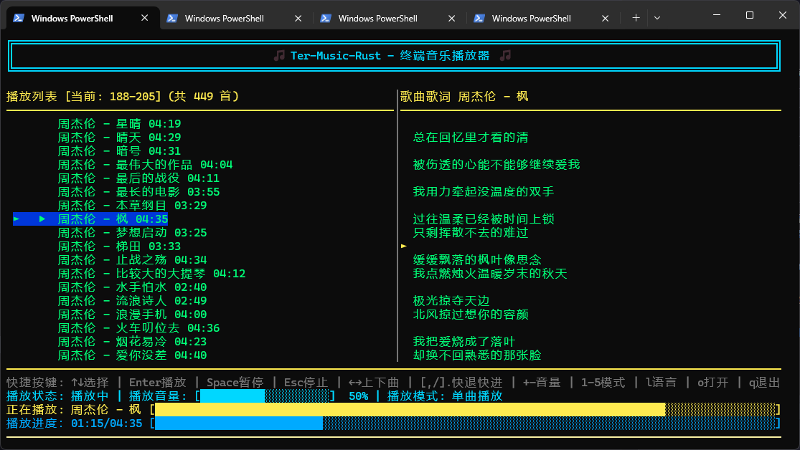

<div align="center">

[简体中文](README.md) | [English](README_EN.md) | [日本語](README_JA.md) | [한국어](README_KO.md)

</div>

# 🎵 Ter-Music-Rust - Terminal Music Player

A simple and practical terminal-based music player, implemented in Rust, featuring functions such as local/network song search and download, automatic display of lyrics, comment viewing, language and theme switching, and support for Windows, Linux, and MacOS systems.





## ✨ Features

### 🎵 Audio Playback
- **10 audio formats supported**: MP3, WAV, FLAC, OGG, OGA, Opus, M4A, AAC, AIFF, APE
- **Playback controls**: play/pause/stop, previous/next track
- **Seeking**: fast seek by 5s / 10s
- **Progress bar seeking**: click the progress bar to jump precisely
- **Volume control**: real-time adjustment from 0-100, click volume bar to set

### 🔄 5 Playback Modes
| Key | Mode | Description |
|------|------|------|
| `1` | Single Play | Stop after current track finishes |
| `2` | Single Loop | Repeat current track |
| `3` | Sequential Play | Play in order, stop at end |
| `4` | List Loop | Repeat the whole playlist |
| `5` | Shuffle Play | Randomly pick tracks |

### 📜 Lyrics System
- **Local lyric loading**: automatically find matching `.lrc` files
- **Lyric encoding detection**: auto-detect UTF-8 / GBK
- **Automatic online download**: async background download when local lyrics are missing
- **Scrolling highlight**: current line is highlighted with `►`, auto-centered scrolling
- **Lyric position jump**: drag lyric area or use mouse wheel to jump by lyric timestamp

### 🔍 Search
- **Local search**: press `s` to search songs in current music directory
- **Online search**: press `n` to search online songs by keyword (Kuwo + Kugou + NetEase, 3 platforms)
- **Paging**: `PgUp` / `PgDn` for more results
- **Online download**: press `Enter` on selected online result to download into current music directory (with progress display)

### 🤖 song Info
- **Smart query**: press `i` to query detailed song information using DeepSeek
- **Streaming output**: results are displayed character by character, no need to wait for full generation
- **Rich information**: covers 13 categories including artist details, songwriting, album track listing, creative background, song meaning, musical style, and more
- **Multi-language support**: response language follows the UI language setting (SC/TC/EN/JP/KR)
- **API Key configuration**: press `k` to input DeepSeek API Key, or set via `DEEPSEEK_API_KEY` environment variable

### ⭐ Favorites
- **Add/remove favorites**: press `f` to toggle favorite state of current track
- **Favorites list**: press `v` to view favorites (with `★` marker)
- **Cross-directory playback**: auto-switch directory when a favorite is outside current directory
- **Delete favorite**: press `d` in favorites list

### 💬 Comments
- **Song comments**: press `c` to view comments of current song
- **Comment details**: press `Enter` to toggle list/detail view (full text in detail)
- **Reply display**: shows original replied comment text, nickname, and time
- **Comment paging**: `PgUp` / `PgDn`, 20 comments per page
- **Background loading**: comments are fetched in background threads without blocking UI

### 📂 Directory Management
- **Choose music directory**: press `o` to open folder picker dialog (playback starts automatically after first successful open)
- **Open directory history**: press `h` to view and quickly switch directories
- **Current directory marker**: `▶` indicates currently active directory
- **Delete history item**: press `d` in history view

### 🌐 Multi-language UI
Supports 5 UI languages (cycle with `l`):

| Language | Config Value |
|------|--------|
| Simplified Chinese | `zh-CN` |
| Traditional Chinese | `zh-TW` |
| English | `en` |
| Japanese | `ja` |
| Korean | `ko` |

### 🎨 Multi-theme UI
Supports 4 themes (cycle with `t`):

| Theme | Style |
|------|------|
| Neon | Neon tone |
| Sunset | Warm sunset gold |
| Ocean | Deep ocean blue |
| GrayWhite | Console-like grayscale |

### 🖱️ Mouse Interaction
- **Playlist click**: click to play song directly
- **Progress bar click**: jump to specific position
- **Volume bar click**: adjust volume
- **Lyric drag**: left-drag to jump to lyric timestamp
- **Lyric wheel**: scroll up/down to jump to previous/next lyric line
- **Search result click**: local search click to play, online search click to download
- **Comment click**: click to open detail

### 📊 Waveform Visualization
- Dynamic waveform bars based on real RMS volume during playback
- EMA smoothing for softer visuals
- Waveform freezes when paused

### ⚙️ Persistent Configuration
Configuration is stored in `USERPROFILE/ter-music-rust/config.json` in the program directory and is auto-saved/restored:

| Config Item | Description |
|--------|------|
| `music_directory` | Last opened music directory |
| `play_mode` | Playback mode |
| `current_index` | Last played song index (resume playback) |
| `volume` | Volume (0-100) |
| `favorites` | Favorites list |
| `dir_history` | Directory history |
| `deepseek_api_key` | DeepSeek API Key (for song info query) |
| `theme` | Theme name |
| `language` | UI language (`zh-CN` / `zh-TW` / `en` / `ja` / `ko`) |

**Auto-save triggers**: track change, theme change, language change, favorite change, every 30 seconds, and on exit (including Ctrl+C)

---

## 🚀 Quick Start

### 1. Install Rust

```powershell
# Method 1: winget (recommended)
winget install Rustlang.Rustup

# Method 2: official installer
# Visit https://rustup.rs/ and install
```

Verify installation:

```powershell
rustc --version
cargo --version
```

### 2. Build the project

```powershell
cd <project-directory>

# Method 1: build script (recommended)
build-win.bat

# Method 2: Cargo
cargo build --release
```

### 3. Run

```powershell
# Method 1: cargo run
cargo run --release

# Method 2: run executable directly
.\target\release\ter-music-rust.exe

# Method 3: specify music directory
.\target\release\ter-music-rust.exe -o d:\Music
cargo run --release -- -o d:\Music
```

**Directory loading priority**: command line `-o` > config file > folder picker dialog

---

## 🎮 Keyboard Shortcuts

### Main View

| Key | Action |
|------|------|
| `↑/↓` | Select song |
| `Enter` | Play selected song |
| `Space` | Play/Pause |
| `Esc` | Stop playback (in comments view: back to lyrics) |
| `←/→` | Previous/Next song |
| `[` | Seek backward 5s |
| `]` | Seek forward 5s |
| `,` | Seek backward 10s |
| `.` | Seek forward 10s |
| `+/-` | Volume up/down (step 5) |
| `1-5` | Switch playback mode |
| `o` | Open music directory |
| `s` | Search local songs |
| `n` | Search online songs |
| `f` | Favorite/Unfavorite |
| `v` | View favorites |
| `h` | View directory history |
| `c` | View song comments |
| `i` | song info query (DeepSeek) |
| `k` | Input DeepSeek API Key |
| `l` | Switch UI language (SC/TC/EN/JP/KR) |
| `t` | Switch theme |
| `q` | Quit |

### Search View

| Key | Action |
|------|------|
| Character input | Enter search keyword |
| `Backspace` | Delete character |
| `Enter` | Search/Play/Download |
| `↑/↓` | Select result |
| `PgUp/PgDn` | Page up/down (online search) |
| `s/n` | Switch local/online search |
| `Esc` | Exit search |

### Favorites View

| Key | Action |
|------|------|
| `↑/↓` | Select song |
| `Enter` | Play selected song |
| `d` | Delete favorite |
| `Esc` | Back to playlist |

### Directory History View

| Key | Action |
|------|------|
| `↑/↓` | Select directory |
| `Enter` | Switch to selected directory |
| `d` | Delete record |
| `Esc` | Back to playlist |

### Comments View

| Key | Action |
|------|------|
| `↑/↓` | Select comment |
| `Enter` | Toggle list/detail view |
| `PgUp/PgDn` | Page up/down |
| `Esc` | Back to lyrics view |

---

## 📦 Installation & Build

### System Requirements

- **OS**: Windows 10/11
- **Rust**: 1.70+
- **Terminal**: Windows Terminal (recommended) / CMD / PowerShell
- **Window size**: 80×25 or larger recommended

### Option 1: MSVC Toolchain (best compatibility, larger size)

```powershell
# 1. Install Rust
winget install Rustlang.Rustup

# 2. Install Build Tools
winget install Microsoft.VisualStudio.2022.BuildTools
# Run installer -> select "Desktop development with C++" -> install

# 3. Restart terminal and build
cargo build --release
```

### Option 2: GNU Toolchain (recommended, lightweight ~300 MB)

```powershell
# 1. Install Rust
winget install Rustlang.Rustup

# 2. Install MSYS2
winget install MSYS2.MSYS2
# In MSYS2 terminal run:
pacman -Syu
pacman -S mingw-w64-x86_64-toolchain

# 3. Add PATH (PowerShell as Administrator)
[Environment]::SetEnvironmentVariable("Path", $env:Path + ";C:\msys64\mingw64\bin", "Machine")

# 4. Switch toolchain and build
rustup default stable-x86_64-pc-windows-gnu
cargo build --release
```

> Programs built with GNU toolchain may require these DLLs in the executable directory:
> `libgcc_s_seh-1.dll`, `libstdc++-6.dll`, `libwinpthread-1.dll`

### Option 3: Cross-compile Linux on Windows

Use `cargo-zigbuild` + `zig` as linker. No Linux VM/system installation required.

```powershell
# 1. Install zig (choose one)
# A: via pip (recommended)
pip install ziglang

# B: via MSYS2
pacman -S mingw-w64-x86_64-zig

# C: manual download
# Visit https://ziglang.org/download/, extract and add to PATH

# 2. Install cargo-zigbuild
cargo install cargo-zigbuild

# 3. Add Linux target
rustup target add x86_64-unknown-linux-gnu

# 4. Prepare Linux sysroot (ALSA headers/libs)
# Project already includes linux-sysroot/
# If preparing manually, copy from Debian/Ubuntu:
#   /usr/include/alsa/ -> linux-sysroot/usr/include/alsa/
#   /usr/lib/x86_64-linux-gnu/libasound.so* -> linux-sysroot/usr/lib/x86_64-linux-gnu/

# 5. Build
build-linux.bat

# Or run manually:
cargo zigbuild --release --target x86_64-unknown-linux-gnu.2.34
```

**Output**: `target/x86_64-unknown-linux-gnu/release/ter-music-rust`

**Deploy to Linux**:

```bash
# 1. Copy to Linux host
scp ter-music-rust user@linux-host:~/

# 2. Make executable
chmod +x ter-music-rust

# 3. Install ALSA runtime
sudo apt install libasound2

# 4. Run
./ter-music-rust -o /path/to/music
```

> `build-linux.bat` auto-configures `PKG_CONFIG_PATH`, `PKG_CONFIG_ALLOW_CROSS`, `RUSTFLAGS`, etc.
> In target `x86_64-unknown-linux-gnu.2.34`, `.2.34` indicates minimum glibc version for better compatibility with older Linux systems.

### Linux Packaging (DEB / RPM)

If you build/package on Linux, use:

```bash
# 1) RPM
./build-rpm.sh

# Generate debuginfo RPM (optional)
./build-rpm.sh --with-debuginfo

# 2) DEB
./build-deb.sh

# Generate debug symbols DEB (optional)
./build-deb.sh --with-debuginfo

# Generate source package compliant with dpkg-source (.dsc/.orig.tar/.debian.tar)
./build-deb.sh --with-source

# Generate both debuginfo + source package
./build-deb.sh --with-debuginfo --with-source
```

Default output directories:
- `dist/rpm/`: RPM / SRPM
- `dist/deb/`: DEB / source packages

> Scripts read `name` and `version` from `Cargo.toml` to auto-name package files.

### Option 4: Cross-compile MacOS on Windows

Use `cargo-zigbuild` + `zig` + MacOS SDK. Audio on MacOS uses CoreAudio and requires SDK headers.

**Prerequisites:**

```powershell
# 1. Install zig (same as Linux cross-compile)
pip install ziglang

# 2. Install cargo-zigbuild
cargo install cargo-zigbuild

# 3. Install LLVM/Clang (provides libclang.dll for bindgen)
# A: via MSYS2
pacman -S mingw-w64-x86_64-clang

# B: official LLVM
winget install LLVM.LLVM

# 4. Add MacOS targets
rustup target add x86_64-apple-darwin aarch64-apple-darwin
```

**Prepare MacOS SDK:**

Extract `MacOSX13.3.sdk.tar.xz` into `macos-sysroot`.
The project already includes `macos-sysroot/` (downloaded from [macosx-sdks](https://github.com/joseluisq/macosx-sdks)).

To fetch again:

```powershell
# A: Download prepackaged SDK from GitHub (recommended, ~56 MB)
# Mirror: https://ghfast.top/https://github.com/joseluisq/macosx-sdks/releases/download/13.3/MacOSX13.3.sdk.tar.xz
curl -L -o MacOSX13.3.sdk.tar.xz https://github.com/joseluisq/macosx-sdks/releases/download/13.3/MacOSX13.3.sdk.tar.xz
mkdir macos-sysroot
tar -xf MacOSX13.3.sdk.tar.xz -C macos-sysroot --strip-components=1
del MacOSX13.3.sdk.tar.xz

# B: Copy from a MacOS system
scp -r mac:/Library/Developer/CommandLineTools/SDKs/MacOSX.sdk ./macos-sysroot
```

> SDK source: https://github.com/joseluisq/macosx-sdks
> Includes headers for CoreAudio, AudioToolbox, AudioUnit, CoreMIDI, OpenAL, IOKit, etc.

**Build:**

```powershell
# Use build script (auto-sets all env vars)
build-mac.bat

# Or manually:
$env:LIBCLANG_PATH = "C:\msys64\mingw64\bin"      # Directory containing libclang.dll
$env:COREAUDIO_SDK_PATH = "./macos-sysroot"         # MacOS SDK path (forward slashes)
$env:SDKROOT = "./macos-sysroot"                    # Needed by zig linker to locate system libs
$FW = "./macos-sysroot/System/Library/Frameworks"
$env:BINDGEN_EXTRA_CLANG_ARGS = "--target=x86_64-apple-darwin -isysroot ./macos-sysroot -F $FW -iframework $FW -I ./macos-sysroot/usr/include"
cargo zigbuild --release --target x86_64-apple-darwin   # Intel Mac
# For Apple Silicon, replace x86_64 with aarch64 in both target and clang args
cargo zigbuild --release --target aarch64-apple-darwin  # Apple Silicon
```

**Outputs:**
- `target/x86_64-apple-darwin/release/ter-music-rust` — Intel Mac
- `target/aarch64-apple-darwin/release/ter-music-rust` — Apple Silicon (M1/M2/M3/M4)

**Deploy to MacOS:**

```bash
# 1. Copy to MacOS host
scp ter-music-rust user@mac-host:~/

# 2. Make executable
chmod +x ter-music-rust

# 3. Allow running unknown-source binary
xattr -cr ter-music-rust

# 4. Run (no extra audio libs required)
./ter-music-rust -o /path/to/music
```

> Note: MacOS cross-compilation requires MacOS SDK headers; this project already includes `macos-sysroot/`.
> It also requires `libclang.dll` (install via MSYS2 or LLVM).

### Switching Toolchains

```powershell
# Show current toolchain
rustup show

# Switch to MSVC
rustup default stable-x86_64-pc-windows-msvc

# Switch to GNU
rustup default stable-x86_64-pc-windows-gnu
```

### Cargo Mirror in China (faster downloads)

Create or edit `~/.cargo/config`:

```toml
[source.crates-io]
replace-with = 'ustc'

[source.ustc]
registry = "https://mirrors.ustc.edu.cn/crates.io-index"
```

---

## 🛠️ Project Structure

```text
src/
├── main.rs       # Program entry (arg parsing, init, config restore/save)
├── defs.rs       # Shared definitions (PlayMode/PlayState enums, MusicFile/Playlist structs)
├── audio.rs      # Audio control (rodio wrapper, play/pause/seek/volume/progress)
├── analyzer.rs   # Audio analyzer (real-time RMS volume, EMA smoothing, waveform rendering)
├── playlist.rs   # Playlist management (directory scan, parallel duration loading, folder picker)
├── lyrics.rs     # Lyric parsing (LRC, local search, encoding detection, background download)
├── search.rs     # Online search/download (Kuwo + Kugou + NetEase search, download, comments fetch, song info streaming query)
├── config.rs     # Config management (JSON serialization, 8 persistent items)
└── ui.rs         # UI (terminal rendering, event handling, multi-view mode, theme/language system)
```

### Tech Stack

| Dependency | Version | Purpose |
|------|------|------|
| [rodio](https://github.com/RustAudio/rodio) | 0.19 | Audio decoding and playback (pure Rust) |
| [crossterm](https://github.com/crossterm-rs/crossterm) | 0.28 | Terminal UI control |
| [reqwest](https://github.com/seanmonstar/reqwest) | 0.12 | HTTP requests |
| [serde](https://github.com/serde-rs/serde) + serde_json | 1.0 | JSON serialization |
| [rayon](https://github.com/rayon-rs/rayon) | 1.10 | Parallel audio duration loading |
| [encoding_rs](https://github.com/hsivonen/encoding_rs) | 0.8 | GBK lyric decoding |
| [walkdir](https://github.com/BurntSushi/walkdir) | 2.5 | Recursive directory scanning |
| [rand](https://github.com/rust-random/rand) | 0.8 | Shuffle mode |
| [unicode-width](https://github.com/unicode-rs/unicode-width) | 0.2 | CJK display width calculation |
| [chrono](https://github.com/chronotope/chrono) | 0.4 | Comment time formatting |
| [ctrlc](https://github.com/Detegr/rust-ctrlc) | 3.4 | Ctrl+C signal handling |
| [md5](https://github.com/johannhof/md5) | 0.7 | Kugou Music API MD5 signature |
| [winapi](https://github.com/retep998/winapi-rs) | 0.3 | Windows console UTF-8 support |

### Release Build Optimization

```toml
[profile.release]
opt-level = 3       # highest optimization level
lto = true          # link-time optimization
codegen-units = 1   # single codegen unit for better optimization
strip = true        # strip debug symbols
```

---

## 🆚 Compared with C Version

| Feature | Rust Version | C Version |
|------|-----------|--------|
| Installation size | ~200 MB (Rust) / ~300 MB (GNU) | ~7 GB (Visual Studio) |
| Setup time | ~5 min | ~1 hour |
| Compile speed | ⚡ Fast | 🐢 Slower |
| Dependency management | ✅ Automatic via Cargo | ❌ Manual setup |
| Memory safety | ✅ Compile-time guarantees | ⚠️ Manual management needed |
| Cross-platform | ✅ Fully cross-platform | ⚠️ Requires code changes |
| Executable size | ~2 MB | ~500 KB |
| Memory usage | ~15-20 MB | ~10 MB |
| CPU usage | < 1% | < 1% |

---

## 📊 Performance

| Metric | Value |
|------|------|
| UI refresh interval | 50ms |
| Key response | < 50ms |
| Lyric download | Background, non-blocking |
| Directory scan | Parallel duration loading, 2-4x speedup |
| Startup time | < 100ms |
| Memory usage | ~15-20 MB |

---

## 🐛 Troubleshooting

### Build errors

```powershell
# Update Rust
rustup update

# Clean and rebuild
cargo clean
cargo build --release
```

### `link.exe not found`

Install Visual Studio Build Tools (see Option 1 above).

### `dlltool.exe not found`

Install full MinGW-w64 toolchain (see Option 2 above).

### Missing runtime DLLs (GNU toolchain)

```powershell
Copy-Item "C:\msys64\mingw64\bin\libgcc_s_seh-1.dll" -Destination ".\target\release\"
Copy-Item "C:\msys64\mingw64\bin\libstdc++-6.dll" -Destination ".\target\release\"
Copy-Item "C:\msys64\mingw64\bin\libwinpthread-1.dll" -Destination ".\target\release\"
```

### No audio device found

1. Ensure your system audio device is working
2. Check Windows volume settings
3. Try playing a system test sound

### UI rendering issues

- Ensure terminal window size is at least 80×25
- Use Windows Terminal for best experience
- In CMD, make sure the selected font supports CJK if needed

### Online search / lyric download fails

- Check your network connection
- Some songs may require VIP access or may be removed
- Lyric file must be valid standard LRC format

### song info query fails

- Make sure `DEEPSEEK_API_KEY` is set (press `k` or set environment variable)
- DeepSeek API Key can be obtained at [platform.deepseek.com](https://platform.deepseek.com/)
- Check network connectivity to DeepSeek API

### Slow first build

The first build downloads and compiles all dependencies; this is expected. Later builds are much faster.

### Download Releases
[ter-music-rust-win.zip](https://storage.deepin.org/thread/20260424040153978_ter-music-rust-win.zip "附件(Attached)")
[ter-music-rust-mac.zip](https://storage.deepin.org/thread/202604240401592657_ter-music-rust-mac.zip "附件(Attached)")
[ter-music-rust-linux.zip](https://storage.deepin.org/thread/202604240402067488_ter-music-rust-linux.zip "附件(Attached)")

---

## 📝 Changelog

## Version 1.2.0 (2026-04-24)

### 🎉 New Features

#### song Info Query
- ✨ **DeepSeek query**: press `i` to stream-query detailed song info via DeepSeek
- ✨ **Streaming output**: results display character by character, no need to wait for full generation
- ✨ **13 info categories**: performers, artist details, songwriting & production, release date, album (with track listing), creative background, song meaning, musical style, commercial performance, awards, impact & reviews, covers & usage, fun facts
- ✨ **Multi-language response**: response language follows UI language (SC/TC/EN/JP/KR)
- ✨ **API Key management**: press `k` to input DeepSeek API Key, or set via `DEEPSEEK_API_KEY` environment variable

#### Kugou Music Source
- ✨ **Kugou Music**: added Kugou as a third search/download platform
- ✨ **3-platform search**: priority order is Kuwo → Kugou → NetEase
- ✨ **Reduced VIP restrictions**: Kugou provides more free download resources
- ✨ **MD5 signature auth**: Kugou download links use MD5 signature for higher success rate

### 🔧 Improvements

#### Song Info Prompt Optimization
- 🔍 **No preamble**: responses no longer include greetings or self-introductions
- 🔍 **No numbered lists**: output content no longer uses numbered list format
- 🔍 **Artist details**: new category with detailed artist information (nationality, birthplace, date of birth, etc.)
- 🔍 **Album track listing**: album section now includes complete track listing

### 💻 Technical Details

#### Dependency Updates
- ➕ Added `md5` dependency (Kugou Music API signature)

#### Data Structures
- ♻️ Added `hash` field to `OnlineSong` (Kugou uses hash to identify songs)
- ♻️ Added `MusicSource::Kugou` enum variant
- ♻️ Added Kugou JSON parsing structs

---

## Version 1.1.0 (2026-04-17)

### 🎉 New Features

#### Lyrics display system
- ✨ **Two-panel layout**: song list on the left, lyrics on the right
- ✨ **Auto lyric download**: download from network when lyrics are missing
- ✨ **Smart matching**: auto-find marked lyric filenames
- ✨ **Multi-encoding support**: supports UTF-8 and GBK lyric files
- ✨ **Lyric scrolling**: auto-scroll with playback progress
- ✨ **Highlighting**: current lyric line highlighted in yellow
- ✨ **Song title display**: lyric title shows current song name

#### User experience
- ✨ **Lyric auto-matching/downloading** during playback
- ✨ **Unified style**: playlist and lyric area use consistent yellow style
- ✨ **Dynamic title**: lyric title updates with current song
- ✨ **Language switching** support
- ✨ **Theme switching** support

### 🚀 Performance Optimization

#### UI rendering
- ⚡ **Smoother progress bar updates**
- ⚡ **Reduced redraws** by optimizing event loop
- ⚡ **Lock optimization** to improve responsiveness

#### Lyrics loading
- ⚡ **Smart cache** after loading to avoid repeated parsing
- ⚡ **Lazy loading** only when needed
- ⚡ **Batch rename support** to clean lyric filename markers

### 🎨 UI Improvements

#### Visual updates
- 🎨 **Unified color scheme** in playlist and lyric area
- 🎨 **Split layout** for better space utilization
- 🎨 **Middle separator line** for clearer visual structure

#### Information display
- 📊 **Visible playlist range** display
- 📊 **Song name in lyric title**
- 📊 **More frequent progress bar updates**

### 🔧 Functional Improvements

#### Lyrics management
- 🔍 **Smart lookup** for multiple lyric filename patterns
- 🔍 **File mapping** ensures one-to-one song-lyric matching

#### Error handling
- 🛡️ **Friendly prompts** on download failure
- 🛡️ **Automatic encoding detection** for lyric files
- 🛡️ **10-second network timeout** to avoid long blocking waits

### 🐛 Bug Fixes

- 🐛 Fixed lyric mismatch caused by filename markers
- 🐛 Fixed encoding issues in lyric downloading
- 🐛 Fixed UI flickering during redraw
- 🐛 Fixed delayed progress bar updates

### 💻 Technical Details

#### Dependency updates
- ➕ Added `reqwest` HTTP client
- ➕ Added `urlencoding` support
- ➕ Added `encoding_rs` transcoding support

#### Refactoring
- ♻️ Optimized event loop logic
- ♻️ Improved lyric loading flow
- ♻️ Unified color constant definitions

---

## Version 1.0.0 (2026-04-09)

### Core features
- 🎵 Audio playback (multi-format)
- 📋 Playlist management
- 🎹 Playback controls
- 🔊 Volume control
- 🎲 Playback mode switching
- 📂 Folder browsing

---

## 📄 AI Assistance

GLM, Codex

## 📄 License

MIT License

## 🤝 Contributing

Issues and Pull Requests are welcome!
