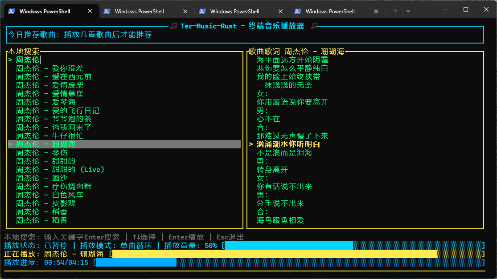
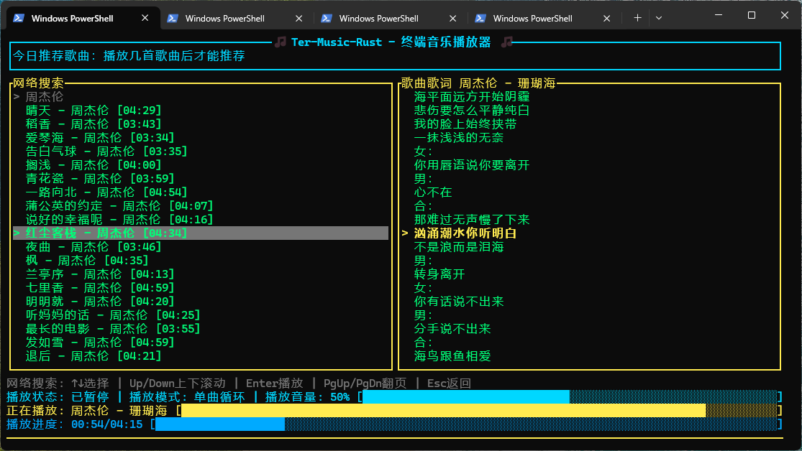
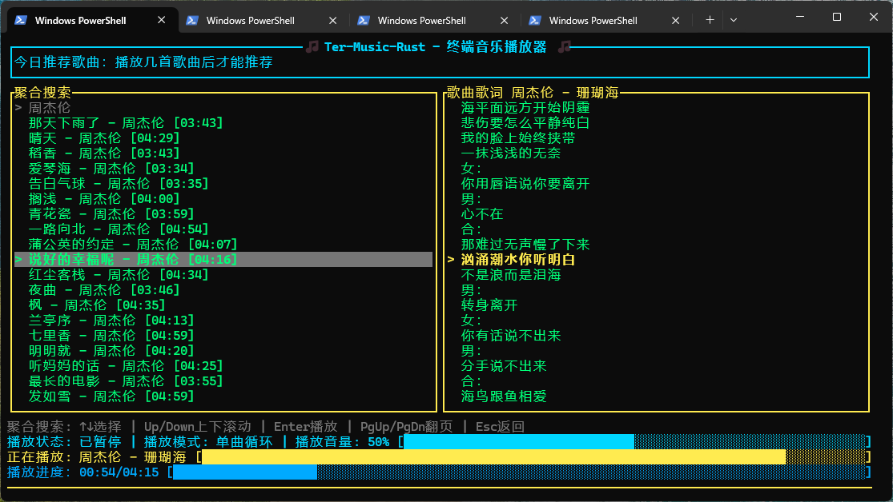
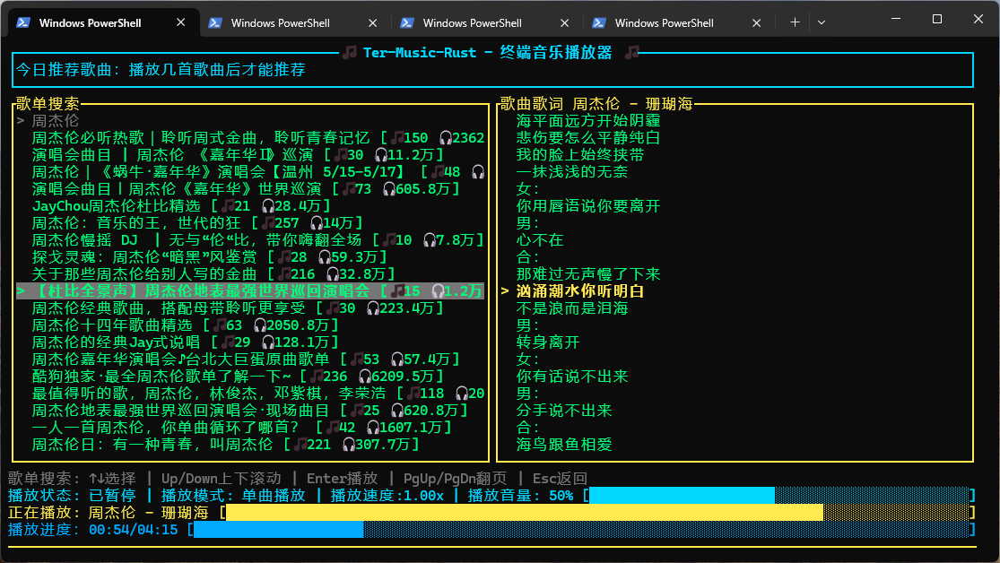
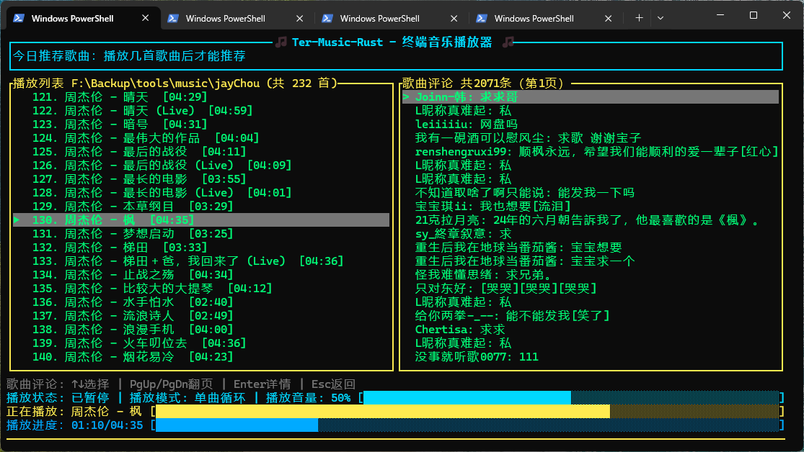

<div align="center">

[简体中文](README.md) | [繁體中文](README_TC.md) | [English](README_EN.md) | [日本語](README_JA.md) | [한국어](README_KO.md) | [Русский](README_RU.md) | [Français](README_FR.md) | [Deutsch](README_DE.md) | [Español](README_ES.md) | [Italiano](README_IT.md) | [Português](README_PT.md)

# 🎵 Ter-Music-Rust - Reproductor de música para terminal 🎵

</div>

Un reproductor de música para terminal, simple y práctico, implementado en Rust. Admite búsqueda y descarga local/en línea, descarga y visualización automática de letras, visualización de comentarios y cambio de idioma/tema, con soporte para Windows, Linux y MacOS.












## ✨ Características

### 🎵 Reproducción de audio
- **10 formatos de audio compatibles**: MP3, WAV, FLAC, OGG, OGA, Opus, M4A, AAC, AIFF, APE
- **Controles de reproducción**: reproducir/pausar/detener, pista anterior/siguiente
- **Avance rápido**: avance rápido de 5s / 10s
- **Barra de progreso**: haz clic en la barra de progreso para saltar con precisión
- **Control de volumen**: ajuste en tiempo real de 0 a 100, haz clic en la barra de volumen para establecer

### 🔄 5 Modos de reproducción
| Tecla | Modo | Descripción |
|------|------|------|
| `1` | Reproducción simple | Detener al terminar la pista actual |
| `2` | Repetición simple | Repetir la pista actual |
| `3` | Reproducción secuencial | Reproducir en orden, detener al final |
| `4` | Repetición de lista | Repetir toda la lista de reproducción |
| `5` | Reproducción aleatoria | Seleccionar pistas al azar |

### 📜 Sistema de letras
- **Carga de letras locales**: búsqueda automática de archivos `.lrc` coincidentes
- **Detección de codificación de letras**: detección automática de UTF-8 / GBK
- **Descarga automática en línea**: descarga asíncrona en segundo plano cuando faltan letras locales
- **Desplazamiento resaltado**: la línea actual se resalta con `►`, desplazamiento automático centrado
- **Salto por marca de letra**: arrastra el área de letras o usa la rueda del ratón para saltar por marca de tiempo

### 🔍 Búsqueda
- **Búsqueda local**: pulsa `s` para buscar canciones en el directorio de música actual
- **Búsqueda en línea**: pulsa `n` para buscar canciones en línea por palabra clave
- **Búsqueda Juhe**: Pulsa `j` para entrar. Busca canciones Juhe basándose en la coincidencia de palabras clave.
- **Búsqueda de listas**: Pulsa `p` para entrar. Busca listas de reproducción en línea basándose en la coincidencia de palabras clave.
- **Paginación**: `PgUp` / `PgDn` para más resultados
- **Descarga en línea**: pulsa `Enter` en el resultado en línea seleccionado para descargarlo al directorio de música actual (con visualización de progreso)

### 🤖 Información de canciones
- **Consulta inteligente**: pulsa `i` para consultar información detallada de la canción, compatible con cualquier API compatible con OpenAI
- **Salida en streaming**: los resultados se muestran carácter por carácter, sin necesidad de esperar la generación completa
- **Información rica**: cubre 13 categorías incluyendo detalles del artista, composición, lista de pistas del álbum, fondo creativo, significado de la letra, estilo musical, anécdotas y más
- **Soporte multilingüe**: el idioma de respuesta sigue la configuración de idioma de la interfaz (SC/TC/EN/JP/KR)
- **API personalizada**: pulsa `k` para configurar la URL base de la API, la API Key y el nombre del modelo en 3 pasos — compatible con DeepSeek, OpenRouter, AIHubMix y cualquier endpoint compatible con OpenAI
- **Respaldo gratuito**: utiliza automáticamente el modelo gratuito de OpenRouter (minimax/minimax-m2.5:free) cuando no se configura ninguna API Key

### ⭐ Favoritos
- **Añadir/eliminar favoritos**: pulsa `f` para alternar el estado de favorito de la pista actual
- **Lista de favoritos**: pulsa `v` para ver los favoritos (con marcador `★`)
- **Reproducción entre directorios**: cambio automático de directorio cuando un favorito está fuera del directorio actual
- **Eliminar favorito**: pulsa `d` en la lista de favoritos

### 💬 Comentarios
- **Comentarios de canciones**: pulsa `c` para ver los comentarios de la canción actual
- **Detalles del comentario**: pulsa `Enter` para alternar vista de lista/detalle (texto completo en detalle)
- **Visualización de respuestas**: muestra el texto del comentario original respondido, apodo y hora
- **Paginación de comentarios**: `PgUp` / `PgDn`, 20 comentarios por página
- **Carga en segundo plano**: los comentarios se obtienen en hilos en segundo plano sin bloquear la interfaz

### 📂 Gestión de directorios
- **Elegir directorio de música**: pulsa `o` para abrir el diálogo de selección de carpeta (la reproducción comienza automáticamente tras la primera apertura exitosa)
- **Historial de directorios**: pulsa `m` para ver y cambiar rápidamente entre directorios
- **Marcador de directorio actual**: `▶` indica el directorio activo actualmente
- **Eliminar elemento del historial**: pulsa `d` en la vista de historial

### 🌐 Interfaz multilingüe
Soporta 5 idiomas de interfaz (ciclar con `l`):

| Idioma | Valor de configuración |
|------|--------|
| Chino simplificado | `zh-CN` |
| Chino tradicional | `zh-TW` |
| Inglés | `en` |
| Japonés | `ja` |
| Coreano | `ko` |

### 🎨 Interfaz multitema
Soporta 4 temas (ciclar con `t`):

| Tema | Estilo |
|------|------|
| Neón | Tono neón |
| Atardecer | Oro cálido del atardecer |
| Océano | Azul profundo del océano |
| GrisBlanco | Escala de grises tipo consola |

### 🖱️ Interacción con el ratón
- **Clic en lista**: haz clic para reproducir la canción directamente
- **Clic en barra de progreso**: saltar a una posición específica
- **Clic en barra de volumen**: ajustar el volumen
- **Arrastrar letra**: arrastrar con el botón izquierdo para saltar a la marca de tiempo de la letra
- **Rueda en letra**: desplazar arriba/abajo para saltar a la línea de letra anterior/siguiente
- **Clic en resultado de búsqueda**: clic en búsqueda local para reproducir, clic en búsqueda en línea para descargar
- **Clic en comentario**: haz clic para abrir el detalle

### 📊 Visualización de forma de onda
- Barras de forma de onda dinámicas basadas en el volumen RMS real durante la reproducción
- Suavizado EMA para visuales más suaves
- La forma de onda se congela al pausar

### ⚙️ Configuración persistente
La configuración se almacena en `USERPROFILE/ter-music-rust/config.json` en el directorio del programa y se guarda/restaura automáticamente:

| Elemento de configuración | Descripción |
|--------|------|
| `music_directory` | Último directorio de música abierto |
| `play_mode` | Modo de reproducción |
| `current_index` | Índice de la última canción reproducida (reanudar reproducción) |
| `volume` | Volumen (0-100) |
| `favorites` | Lista de favoritos |
| `dir_history` | Historial de directorios |
| `api_key` | API Key (para consulta de información de canciones, compatible con `deepseek_api_key`) |
| `api_base_url` | URL base de la API (predeterminado: `https://api.deepseek.com/`) |
| `api_model` | Nombre del modelo AI (predeterminado: `deepseek-v4-flash`) |
| `github_token` | Token de GitHub (usado para enviar discusiones de información de canciones; dejar vacío para usar Token predeterminado) |
| `theme` | Nombre del tema |
| `language` | Idioma de la interfaz (`zh-CN` / `zh-TW` / `en` / `ja` / `ko`) |

**Disparadores de guardado automático**: cambio de pista, cambio de tema, cambio de idioma, cambio de favoritos, cada 30 segundos y al salir (incluyendo Ctrl+C)

---

## 🚀 Inicio rápido

### 1. Instalar Rust

```powershell
# Método 1: winget (recomendado)
winget install Rustlang.Rustup

# Método 2: instalador oficial
# Visita https://rustup.rs/ e instala
```

Verificar la instalación:

```powershell
rustc --version
cargo --version
```

### 2. Compilar el proyecto

```powershell
cd <directorio-del-proyecto>

# Método 1: script de compilación (recomendado)
build-win.bat

# Método 2: Cargo
cargo build --release
```

### 3. Ejecutar

```powershell
# Método 1: cargo run
cargo run --release

# Método 2: ejecutar directamente el ejecutable
.\target\release\ter-music-rust.exe

# Método 3: especificar directorio de música
.\target\release\ter-music-rust.exe -o d:\Music
cargo run --release -- -o d:\Music
```

**Prioridad de carga de directorio**: línea de comandos `-o` > archivo de configuración > diálogo de selección de carpeta

---

## 🎮 Atajos de teclado

### Vista principal

| Tecla | Acción |
|------|------|
| `↑/↓` | Seleccionar canción |
| `Enter` | Reproducir canción seleccionada |
| `Space` | Reproducir/Pausar |
| `Esc` | Detener reproducción (en vista de comentarios: volver a letras) |
| `←/→` | Canción anterior/Siguiente canción |
| `[` | Retroceder 5s |
| `]` | Avanzar 5s |
| `,` | Retroceder 10s |
| `.` | Avanzar 10s |
| `+/-` | Subir/Bajar volumen (paso 5) |
| `1-5` | Cambiar modo de reproducción |
| `o` | Abrir directorio de música |
| `s` | Buscar canciones locales |
| `n` | Buscar canciones en línea |
| `j` | Buscar canciones Juhe |
| `p` | Buscar listas de reproducción en línea |
| `i` | Consultar información de canción |
| `f` | Añadir/Eliminar favorito |
| `v` | Ver favoritos |
| `m` | Ver historial de directorios |
| `h` | Mostrar información de ayuda |
| `c` | Ver comentarios de canción |
| `l` | Cambiar idioma de la interfaz |
| `t` | Cambiar tema |
| `k` | Configurar endpoint de API |
| `g` | Configurar Token de GitHub |
| `q` | Salir |

### Vista de búsqueda

| Tecla | Acción |
|------|------|
| Entrada de caracteres | Introducir palabra clave de búsqueda |
| `Backspace` | Eliminar carácter |
| `Enter` | Buscar/Reproducir/Descargar |
| `↑/↓` | Seleccionar resultado |
| `PgUp/PgDn` | Página arriba/abajo (búsqueda en línea) |
| `s/n/j` | Cambiar búsqueda local/en línea/Juhe |

| `Esc` | Salir de la búsqueda |

### Vista de favoritos

| Tecla | Acción |
|------|------|
| `↑/↓` | Seleccionar canción |
| `Enter` | Reproducir canción seleccionada |
| `d` | Eliminar favorito |
| `Esc` | Volver a la lista de reproducción |

### Vista de historial de directorios

| Tecla | Acción |
|------|------|
| `↑/↓` | Seleccionar directorio |
| `Enter` | Cambiar al directorio seleccionado |
| `d` | Eliminar registro |
| `Esc` | Volver a la lista de reproducción |

### Vista de comentarios

| Tecla | Acción |
|------|------|
| `↑/↓` | Seleccionar comentario |
| `Enter` | Alternar vista de lista/detalle |
| `PgUp/PgDn` | Página arriba/abajo |
| `Esc` | Volver a la vista de letras |

### Vista de información de canción

| Tecla | Acción |
|------|------|
| `↑/↓` | Desplazar información de canción |
| `i` | Volver a consultar información de canción |
| `Esc` | Volver a la vista de letras |

### Vista de búsqueda de listas de reproducción

| Tecla | Acción |
|------|------|
| Entrada de caracteres | Introducir palabra clave de lista |
| `Backspace` | Eliminar carácter |
| `Enter` | Buscar/Entrar en lista/Reproducir y descargar |
| `↑/↓` | Seleccionar lista o canción |
| `PgUp/PgDn` | Página arriba/abajo |
| `Esc` | Volver al nivel anterior / Salir de la búsqueda |

### Vista de ayuda


| Tecla | Acción |
|------|------|
| `↑/↓` | Desplazar contenido de ayuda |
| `Esc` | Volver a la vista de letras |

---

## 📦 Instalación y compilación

### Requisitos del sistema

- **SO**: Windows 10/11
- **Rust**: 1.70+
- **Terminal**: Windows Terminal (recomendado) / CMD / PowerShell
- **Tamaño de ventana**: 80×25 o mayor recomendado

### Opción 1: Cadena de herramientas MSVC (mejor compatibilidad, mayor tamaño)

```powershell
# 1. Instalar Rust
winget install Rustlang.Rustup

# 2. Instalar Build Tools
winget install Microsoft.VisualStudio.2022.BuildTools
# Ejecutar instalador -> seleccionar "Desktop development with C++" -> instalar

# 3. Reiniciar terminal y compilar
cargo build --release
```

### Opción 2: Cadena de herramientas GNU (recomendada, ligera ~300 MB)

```powershell
# 1. Instalar Rust
winget install Rustlang.Rustup

# 2. Instalar MSYS2
winget install MSYS2.MSYS2
# En la terminal MSYS2 ejecutar:
pacman -Syu
pacman -S mingw-w64-x86_64-toolchain

# 3. Añadir al PATH (PowerShell como Administrador)
[Environment]::SetEnvironmentVariable("Path", $env:Path + ";C:\msys64\mingw64\bin", "Machine")

# 4. Cambiar cadena de herramientas y compilar
rustup default stable-x86_64-pc-windows-gnu
cargo build --release
```

> Los programas compilados con la cadena GNU pueden requerir estas DLLs en el directorio del ejecutable:
> `libgcc_s_seh-1.dll`, `libstdc++-6.dll`, `libwinpthread-1.dll`

### Opción 3: Compilación cruzada de Linux en Windows

Usa `cargo-zigbuild` + `zig` como enlazador. No requiere instalación de VM/sistema Linux.

```powershell
# 1. Instalar zig (elije uno)
# A: vía pip (recomendado)
pip install ziglang

# B: vía MSYS2
pacman -S mingw-w64-x86_64-zig

# C: descarga manual
# Visita https://ziglang.org/download/, extrae y añade al PATH

# 2. Instalar cargo-zigbuild
cargo install cargo-zigbuild

# 3. Añadir target de Linux
rustup target add x86_64-unknown-linux-gnu

# 4. Preparar Linux sysroot (headers/libs de ALSA)
# El proyecto ya incluye linux-sysroot/
# Si se prepara manualmente, copiar desde Debian/Ubuntu:
#   /usr/include/alsa/ -> linux-sysroot/usr/include/alsa/
#   /usr/lib/x86_64-linux-gnu/libasound.so* -> linux-sysroot/usr/lib/x86_64-linux-gnu/

# 5. Compilar
build-linux.bat

# O ejecutar manualmente:
cargo zigbuild --release --target x86_64-unknown-linux-gnu.2.34
```

**Salida**: `target/x86_64-unknown-linux-gnu/release/ter-music-rust`

**Desplegar en Linux**:

```bash
# 1. Copiar al host Linux
scp ter-music-rust user@linux-host:~/

# 2. Hacer ejecutable
chmod +x ter-music-rust

# 3. Instalar ALSA runtime
sudo apt install libasound2

# 4. Ejecutar
./ter-music-rust -o /path/to/music
```

> `build-linux.bat` configura automáticamente `PKG_CONFIG_PATH`, `PKG_CONFIG_ALLOW_CROSS`, `RUSTFLAGS`, etc.
> En el target `x86_64-unknown-linux-gnu.2.34`, `.2.34` indica la versión mínima de glibc para mejor compatibilidad con sistemas Linux antiguos.

### Empaquetado para Linux (DEB / RPM)

Si compilas/empaquetas en Linux, usa:

```bash
# 1) RPM
./build-rpm.sh

# Generar RPM con debuginfo (opcional)
./build-rpm.sh --with-debuginfo

# 2) DEB
./build-deb.sh

# Generar DEB con símbolos de depuración (opcional)
./build-deb.sh --with-debuginfo

# Generar paquete fuente conforme con dpkg-source (.dsc/.orig.tar/.debian.tar)
./build-deb.sh --with-source

# Generar ambos: debuginfo + paquete fuente
./build-deb.sh --with-debuginfo --with-source
```

Directorios de salida predeterminados:
- `dist/rpm/`: RPM / SRPM
- `dist/deb/`: DEB / paquetes fuente

> Los scripts leen `name` y `version` de `Cargo.toml` para nombrar automáticamente los archivos del paquete.

### Opción 4: Compilación cruzada de MacOS en Windows

Usa `cargo-zigbuild` + `zig` + SDK de MacOS. El audio en MacOS usa CoreAudio y requiere headers del SDK.

**Requisitos previos:**

```powershell
# 1. Instalar zig (igual que compilación cruzada de Linux)
pip install ziglang

# 2. Instalar cargo-zigbuild
cargo install cargo-zigbuild

# 3. Instalar LLVM/Clang (proporciona libclang.dll para bindgen)
# A: vía MSYS2
pacman -S mingw-w64-x86_64-clang

# B: LLVM oficial
winget install LLVM.LLVM

# 4. Añadir targets de MacOS
rustup target add x86_64-apple-darwin aarch64-apple-darwin
```

**Preparar SDK de MacOS:**

Extraer `MacOSX13.3.sdk.tar.xz` en `macos-sysroot`.
El proyecto ya incluye `macos-sysroot/` (descargado de [macosx-sdks](https://github.com/joseluisq/macosx-sdks)).

Para obtenerlo de nuevo:

```powershell
# A: Descargar SDK preempaquetado desde GitHub (recomendado, ~56 MB)
# Mirror: https://ghfast.top/https://github.com/joseluisq/macosx-sdks/releases/download/13.3/MacOSX13.3.sdk.tar.xz
curl -L -o MacOSX13.3.sdk.tar.xz https://github.com/joseluisq/macosx-sdks/releases/download/13.3/MacOSX13.3.sdk.tar.xz
mkdir macos-sysroot
tar -xf MacOSX13.3.sdk.tar.xz -C macos-sysroot --strip-components=1
del MacOSX13.3.sdk.tar.xz

# B: Copiar desde un sistema MacOS
scp -r mac:/Library/Developer/CommandLineTools/SDKs/MacOSX.sdk ./macos-sysroot
```

> Fuente del SDK: https://github.com/joseluisq/macosx-sdks
> Incluye headers para CoreAudio, AudioToolbox, AudioUnit, CoreMIDI, OpenAL, IOKit, etc.

**Compilar:**

```powershell
# Usar script de compilación (configura automáticamente todas las variables de entorno)
build-mac.bat

# O manualmente:
$env:LIBCLANG_PATH = "C:\msys64\mingw64\bin"      # Directorio que contiene libclang.dll
$env:COREAUDIO_SDK_PATH = "./macos-sysroot"         # Ruta del SDK de MacOS (barras diagonales)
$env:SDKROOT = "./macos-sysroot"                    # Necesario para que zig localice las libs del sistema
$FW = "./macos-sysroot/System/Library/Frameworks"
$env:BINDGEN_EXTRA_CLANG_ARGS = "--target=x86_64-apple-darwin -isysroot ./macos-sysroot -F $FW -iframework $FW -I ./macos-sysroot/usr/include"
cargo zigbuild --release --target x86_64-apple-darwin   # Mac Intel
# Para Apple Silicon, reemplazar x86_64 por aarch64 tanto en target como en args de clang
cargo zigbuild --release --target aarch64-apple-darwin  # Apple Silicon
```

**Salidas:**
- `target/x86_64-apple-darwin/release/ter-music-rust` — Mac Intel
- `target/aarch64-apple-darwin/release/ter-music-rust` — Apple Silicon (M1/M2/M3/M4)

**Desplegar en MacOS:**

```bash
# 1. Copiar al host MacOS
scp ter-music-rust user@mac-host:~/

# 2. Hacer ejecutable
chmod +x ter-music-rust

# 3. Permitir ejecutar binario de fuente desconocida
xattr -cr ter-music-rust

# 4. Ejecutar (no se requieren libs de audio adicionales)
./ter-music-rust -o /path/to/music
```

> Nota: La compilación cruzada de MacOS requiere headers del SDK de MacOS; este proyecto ya incluye `macos-sysroot/`.
> También requiere `libclang.dll` (instalar vía MSYS2 o LLVM).

### Cambiar cadena de herramientas

```powershell
# Mostrar cadena de herramientas actual
rustup show

# Cambiar a MSVC
rustup default stable-x86_64-pc-windows-msvc

# Cambiar a GNU
rustup default stable-x86_64-pc-windows-gnu
```

### Espejo de Cargo en China (descargas más rápidas)

Crear o editar `~/.cargo/config`:

```toml
[source.crates-io]
replace-with = 'ustc'

[source.ustc]
registry = "https://mirrors.ustc.edu.cn/crates.io-index"
```

---

## 🛠️ Estructura del proyecto

```text
src/
├── main.rs       # Entrada del programa (análisis de args, inicio, restauración/guardado de configuración)
├── defs.rs       # Definiciones compartidas (enums PlayMode/PlayState, structs MusicFile/Playlist)
├── audio.rs      # Control de audio (wrapper de rodio, reproducir/pausar/buscar/volumen/progreso)
├── analyzer.rs   # Analizador de audio (volumen RMS en tiempo real, suavizado EMA, renderizado de forma de onda)
├── playlist.rs   # Gestión de lista de reproducción (escaneo de directorio, carga paralela de duración, selector de carpeta)
├── lyrics.rs     # Análisis de letras (LRC, búsqueda local, detección de codificación, descarga en segundo plano)
├── search.rs     # Búsqueda/descarga en línea (búsqueda Kuwo + Kugou + NetEase, descarga, obtención de comentarios, consulta en streaming de información)
├── config.rs     # Gestión de configuración (serialización JSON, 8 elementos persistentes)
└── ui.rs         # Interfaz (renderizado de terminal, manejo de eventos, modo multi-vista, sistema de tema/idioma)
```

### Stack tecnológico

| Dependencia | Versión | Propósito |
|------|------|------|
| [rodio](https://github.com/RustAudio/rodio) | 0.19 | Decodificación y reproducción de audio (Rust puro) |
| [crossterm](https://github.com/crossterm-rs/crossterm) | 0.28 | Control de interfaz de terminal |
| [reqwest](https://github.com/seanmonstar/reqwest) | 0.12 | Peticiones HTTP |
| [serde](https://github.com/serde-rs/serde) + serde_json | 1.0 | Serialización JSON |
| [rayon](https://github.com/rayon-rs/rayon) | 1.10 | Carga paralela de duración de audio |
| [encoding_rs](https://github.com/hsivonen/encoding_rs) | 0.8 | Decodificación de letras GBK |
| [walkdir](https://github.com/BurntSushi/walkdir) | 2.5 | Escaneo recursivo de directorios |
| [rand](https://github.com/rust-random/rand) | 0.8 | Modo aleatorio |
| [unicode-width](https://github.com/unicode-rs/unicode-width) | 0.2 | Cálculo de ancho de visualización CJK |
| [chrono](https://github.com/chronotope/chrono) | 0.4 | Formato de hora de comentarios |
| [ctrlc](https://github.com/Detegr/rust-ctrlc) | 3.4 | Manejo de señal Ctrl+C |
| [md5](https://github.com/johannhof/md5) | 0.7 | Firma MD5 de la API de Kugou Music |
| [winapi](https://github.com/retep998/winapi-rs) | 0.3 | Soporte UTF-8 de consola Windows |

### Optimización de compilación Release

```toml
[profile.release]
opt-level = 3       # nivel de optimización más alto
lto = true          # optimización en tiempo de enlace
codegen-units = 1   # unidad de generación de código única para mejor optimización
strip = true        # eliminar símbolos de depuración
```

---

## Rust comparado con la versión C

| Característica | Versión Rust | Versión C |
|------|-----------|--------|
| Tamaño de instalación | ~200 MB (Rust) / ~300 MB (GNU) | ~7 GB (Visual Studio) |
| Tiempo de configuración | ~5 min | ~1 hora |
| Velocidad de compilación | ⚡ Rápida | 🐢 Más lenta |
| Gestión de dependencias | ✅ Automática vía Cargo | ❌ Configuración manual |
| Seguridad de memoria | ✅ Garantías en tiempo de compilación | ⚠️ Gestión manual necesaria |
| Multiplataforma | ✅ Totalmente multiplataforma | ⚠️ Requiere cambios de código |
| Tamaño del ejecutable | ~2 MB | ~500 KB |
| Uso de memoria | ~15-20 MB | ~10 MB |
| Uso de CPU | < 1% | < 1% |

---

## 📊 Rendimiento

| Métrica | Valor |
|------|------|
| Intervalo de refresco de UI | 50ms |
| Respuesta de tecla | < 50ms |
| Descarga de letras | En segundo plano, sin bloqueo |
| Escaneo de directorio | Carga paralela de duración, 2-4x de aceleración |
| Tiempo de inicio | < 100ms |
| Uso de memoria | ~15-20 MB |

---

## 🐛 Solución de problemas

### Errores de compilación

```powershell
# Actualizar Rust
rustup update

# Limpiar y recompilar
cargo clean
cargo build --release
```

### `link.exe not found`

Instalar Visual Studio Build Tools (ver Opción 1 arriba).

### `dlltool.exe not found`

Instalar la cadena de herramientas completa MinGW-w64 (ver Opción 2 arriba).

### DLLs de runtime faltantes (cadena GNU)

```powershell
Copy-Item "C:\msys64\mingw64\bin\libgcc_s_seh-1.dll" -Destination ".\target\release\"
Copy-Item "C:\msys64\mingw64\bin\libstdc++-6.dll" -Destination ".\target\release\"
Copy-Item "C:\msys64\mingw64\bin\libwinpthread-1.dll" -Destination ".\target\release\"
```

### No se encuentra dispositivo de audio

1. Asegúrate de que el dispositivo de audio del sistema funciona
2. Verifica la configuración de volumen de Windows
3. Intenta reproducir un sonido de prueba del sistema

### Problemas de renderizado de UI

- Asegúrate de que el tamaño de la ventana de terminal sea al menos 80×25
- Usa Windows Terminal para la mejor experiencia
- En CMD, asegúrate de que la fuente seleccionada soporte CJK si es necesario

### Búsqueda en línea / descarga de letras fallida

- Verifica tu conexión de red
- Algunas canciones pueden requerir acceso VIP o haber sido eliminadas
- El archivo de letras debe tener un formato LRC estándar válido

### Consulta de información de canción fallida

- Cuando no se configura API Key, se usa automáticamente el modelo gratuito de OpenRouter — no se necesita configuración manual
- Para usar un endpoint personalizado, pulsa `k` e introduce la URL base de la API, la API Key y el nombre del modelo en secuencia
- Compatible con cualquier API compatible con OpenAI (DeepSeek, OpenRouter, AIHubMix, etc.)
- Verifica la conectividad de red al servicio API correspondiente

### Primera compilación lenta

La primera compilación descarga y compila todas las dependencias; esto es esperado. Las compilaciones posteriores son mucho más rápidas.

### Descargar Releases
[ter-music-rust-win.zip](https://storage.deepin.org/thread/202605030941394786_ter-music-rust-win.zip "附件(Attached)")
[ter-music-rust-mac.zip](https://storage.deepin.org/thread/202605030941519730_ter-music-rust-mac.zip "附件(Attached)")
[ter-music-rust-linux.zip](https://storage.deepin.org/thread/20260503094157446_ter-music-rust-linux.zip "附件(Attached)") 
[ter-music-rust_deb.zip](https://storage.deepin.org/thread/202605030942036738_ter-music-rust_deb.zip "附件(Attached)")

---

## 📝 Registro de cambios

## Versión 1.5.0 (2026-04-30)

### 🎉 Nuevas características

#### Búsqueda de listas de reproducción en línea
- ✨ **Entrada de búsqueda de listas**: pulsa `p` para buscar listas de reproducción en línea directamente
- ✨ **Navegación de contenido de listas**: tras entrar en una lista, puedes navegar las canciones y reproducirlas rápidamente
- ✨ **Reproducción por caché**: en búsqueda en línea / búsqueda Juhe / búsqueda de listas, si la canción ya existe localmente o coincide con la caché descargada, se salta la descarga duplicada y se reproduce directamente
- ✨ **Descarga de letras sin duplicados**: en búsqueda en línea / búsqueda Juhe / búsqueda de listas, si la canción ya existe localmente o coincide con la caché descargada, los archivos de letras no se descargan repetidamente

### 🔧 Mejoras

- 🎵 **Optimización de estrategia de letras**: durante la reproducción, las letras ahora usan "Juhe primero, regular como respaldo" para mejorar la precisión de coincidencia
- 🎯 **Optimización del foco de búsqueda**: al pulsar `s/n/j/p` ahora se enfoca la entrada de búsqueda por defecto, para que puedas escribir inmediatamente
- 🎯 **Optimización de interacción búsqueda-a-lista**: tras pulsar Enter o hacer clic en una canción para iniciar la reproducción, el foco cambia a la lista para que los atajos de teclado ya no vayan al cuadro de búsqueda
- 🎯 **Consistencia de estilo de lista en línea**: en las vistas de búsqueda en línea/Juhe/listas, el cursor de selección y el marcador de reproducción están separados y el espaciado está alineado con el estilo de lista local
- 🎲 **Optimización de consistencia aleatoria en línea**: en modo Aleatorio, los resultados de búsqueda en línea y Juhe ahora soportan comportamiento de siguiente automático aleatorio consistente con la reproducción de lista
- 🛡️ **Protección de siguiente automático en línea**: añadida limitación de tasa para saltos automáticos en línea; si ocurren 5 saltos automáticos consecutivos en 3 segundos, la reproducción se detiene automáticamente para evitar saltos incontrolados en pistas no reproducibles

### 🐞 Correcciones de errores

- 🛠️ **Corrección de prioridad de letras**: corregido el orden incorrecto de prioridad de descarga de letras en los flujos de búsqueda en línea / búsqueda Juhe / búsqueda de listas
- 🛠️ **Corrección de índice de reproducción automática en línea**: corregido un problema donde mover el cursor durante la reproducción podía hacer que el siguiente automático continuara desde la posición del cursor en lugar de la canción realmente reproduciéndose
- 🛠️ **Corrección de entrada de tecla Espacio en búsqueda**: corregido un problema donde Espacio se escribía en el cuadro de búsqueda en estado de foco de lista y cambiaba/limpiaba inesperadamente los resultados
- 🛠️ **Corrección de foco inicial de búsqueda de red**: corregido foco de entrada inicial faltante al entrar en la búsqueda de red con `n`
- 🛠️ **Corrección de comportamiento faltante aleatorio en línea**: corregido un problema donde el modo Aleatorio no surtía efecto en las listas de resultados de búsqueda en línea / búsqueda Juhe
- 🛠️ **Corrección de parada prematura de siguiente automático en línea**: corregido un problema donde la reproducción podía detenerse prematuramente cuando la primera pista en línea no era reproducible contando solo intentos reales de siguiente automático y reiniciando la ventana tras reproducción exitosa

---

## Versión 1.4.0 (2026-04-28)


### 🎉 Nuevas características

#### Búsqueda Juhe como respaldo
- ✨ **Búsqueda Juhe de canciones**: Cuando la búsqueda en línea falla, puedes usar la búsqueda Juhe para buscar canciones por título/cantante y descargarlas.
- ✨ **Búsqueda Juhe de letras**: Si no hay letras locales y la búsqueda en línea falla, el sistema buscará automáticamente letras por título/cantante a través de la búsqueda Juhe y las descargará.
- ✨ **Experiencia fluida**: la búsqueda y descarga ocurren en segundo plano sin bloquear la interfaz

#### Configuración de Token de GitHub
- ✨ **Token de GitHub personalizado**: pulsa `g` para introducir tu propio Token de GitHub, guardado en el archivo de configuración
- ✨ **Respaldo predeterminado**: usa automáticamente un Token predeterminado cuando no está configurado
- ✨ **Reconocimiento de identidad**: Al enviar información de canciones para discusión usando tu propio Token, se mostrará tu identidad de GitHub.

### 🔧 Mejoras

- 🔍 **Nuevo elemento de configuración**: `github_token` (Token de GitHub, dejar vacío para usar el predeterminado)

---

## Versión 1.3.0 (2026-04-26)

### 🎉 Nuevas características

#### Endpoint de API AI personalizado
- ✨ **API compatible con OpenAI**: soporta cualquier API compatible con OpenAI para consultas de información de canciones (DeepSeek, OpenRouter, OpenAI, etc.)
- ✨ **Configuración en 3 pasos**: pulsa `k` para introducir secuencialmente URL base de la API → API Key → nombre del modelo
- ✨ **Respaldo gratuito**: utiliza automáticamente el modelo gratuito de OpenRouter (minimax/minimax-m2.5:free) cuando no se configura API Key
- ✨ **Consulta directa**: pulsa `i` para consultar información de canción directamente — no se requiere preconfiguración de API Key

### 🔧 Mejoras

- 🔍 **Optimización del prompt**: renombrado "Significado de la canción" → "Significado de la letra", "Datos curiosos" → "Anécdotas"
- 🔍 **Campo de configuración renombrado**: `deepseek_api_key` → `api_key` (compatible con archivos de configuración existentes)
- 🔍 **Nuevos elementos de configuración**: `api_base_url` (endpoint de API, predeterminado DeepSeek), `api_model` (nombre del modelo, predeterminado deepseek-v4-flash)

---

## Versión 1.2.0 (2026-04-24)

### 🎉 Nuevas características

#### Consulta de información de canción
- ✨ **Consulta DeepSeek**: pulsa `i` para consultar en streaming información detallada de la canción vía DeepSeek
- ✨ **Salida en streaming**: los resultados se muestran carácter por carácter, sin necesidad de esperar la generación completa
- ✨ **13 categorías de información**: intérpretes, detalles del artista, composición y producción, fecha de lanzamiento, álbum (con lista de pistas), fondo creativo, significado de la canción, estilo musical, rendimiento comercial, premios, impacto y críticas, versiones y usos, anécdotas
- ✨ **Respuesta multilingüe**: el idioma de respuesta sigue el idioma de la interfaz (SC/TC/EN/JP/KR)
- ✨ **Gestión de API Key**: pulsa `k` para introducir la API Key de DeepSeek, o establecerla mediante la variable de entorno `DEEPSEEK_API_KEY`

#### Fuente de música Kugou
- ✨ **Música Kugou**: añadido Kugou como tercera plataforma de búsqueda/descarga
- ✨ **Búsqueda en 3 plataformas**: orden de prioridad es Kuwo → Kugou → NetEase
- ✨ **Menos restricciones VIP**: Kugou proporciona más recursos de descarga gratuitos
- ✨ **Autenticación con firma MD5**: los enlaces de descarga de Kugou usan firma MD5 para mayor tasa de éxito

### 🔧 Mejoras

#### Optimización del prompt de información de canción
- 🔍 **Sin preámbulo**: las respuestas ya no incluyen saludos ni auto-presentaciones
- 🔍 **Sin listas numeradas**: el contenido de salida ya no usa formato de lista numerada
- 🔍 **Detalles del artista**: nueva categoría con información detallada del artista (nacionalidad, lugar de nacimiento, fecha de nacimiento, etc.)
- 🔍 **Lista de pistas del álbum**: la sección del álbum ahora incluye la lista completa de pistas

### 💻 Detalles técnicos

#### Actualizaciones de dependencias
- ➕ Añadida dependencia `md5` (firma de API de Kugou Music)

#### Estructuras de datos
- ♻️ Añadido campo `hash` a `OnlineSong` (Kugou usa hash para identificar canciones)
- ♻️ Añadida variante de enum `MusicSource::Kugou`
- ♻️ Añadidas estructuras de análisis JSON de Kugou

---

## Versión 1.1.0 (2026-04-17)

### 🎉 Nuevas características

#### Sistema de visualización de letras
- ✨ **Disposición en dos paneles**: lista de canciones a la izquierda, letras a la derecha
- ✨ **Descarga automática de letras**: descargar de la red cuando faltan letras
- ✨ **Coincidencia inteligente**: búsqueda automática de nombres de archivo de letras marcados
- ✨ **Soporte multi-codificación**: soporta archivos de letras UTF-8 y GBK
- ✨ **Desplazamiento de letras**: desplazamiento automático con el progreso de reproducción
- ✨ **Resaltado**: línea de letra actual resaltada en amarillo
- ✨ **Visualización del título de la canción**: el título de las letras muestra el nombre de la canción actual

#### Experiencia de usuario
- ✨ **Coincidencia/descarga automática de letras** durante la reproducción
- ✨ **Estilo unificado**: la lista de reproducción y el área de letras usan estilo amarillo consistente
- ✨ **Título dinámico**: el título de las letras se actualiza con la canción actual
- ✨ **Cambio de idioma** soportado
- ✨ **Cambio de tema** soportado

### 🚀 Optimización de rendimiento

#### Renderizado de UI
- ⚡ **Actualizaciones de barra de progreso más suaves**
- ⚡ **Reducción de redibujos** optimizando el bucle de eventos
- ⚡ **Optimización de locks** para mejorar la capacidad de respuesta

#### Carga de letras
- ⚡ **Caché inteligente** tras la carga para evitar análisis repetido
- ⚡ **Carga perezosa** solo cuando se necesita
- ⚡ **Soporte de renombrado por lotes** para limpiar marcadores de nombres de archivo de letras

### 🎨 Mejoras de UI

#### Actualizaciones visuales
- 🎨 **Esquema de colores unificado** en lista de reproducción y área de letras
- 🎨 **Disposición dividida** para mejor aprovechamiento del espacio
- 🎨 **Línea separadora central** para estructura visual más clara

#### Visualización de información
- 📊 **Visualización del rango visible** de la lista de reproducción
- 📊 **Nombre de canción en título de letras**
- 📊 **Actualizaciones más frecuentes de la barra de progreso**

### 🔧 Mejoras funcionales

#### Gestión de letras
- 🔍 **Búsqueda inteligente** para múltiples patrones de nombres de archivo de letras
- 🔍 **Mapeo de archivos** asegura correspondencia uno a uno canción-letra

#### Manejo de errores
- 🛡️ **Mensajes amigables** en caso de fallo de descarga
- 🛡️ **Detección automática de codificación** para archivos de letras
- 🛡️ **Timeout de red de 10 segundos** para evitar esperas prolongadas

### 🐛 Correcciones de errores

- 🐛 Corregida discrepancia de letras causada por marcadores en nombres de archivo
- 🐛 Corregidos problemas de codificación en la descarga de letras
- 🐛 Corregido parpadeo de UI durante el redibujado
- 🐛 Corregido retraso en actualizaciones de la barra de progreso

### 💻 Detalles técnicos

#### Actualizaciones de dependencias
- ➕ Añadido cliente HTTP `reqwest`
- ➕ Añadido soporte `urlencoding`
- ➕ Añadido soporte de transcodificación `encoding_rs`

#### Refactorización
- ♻️ Optimizada la lógica del bucle de eventos
- ♻️ Mejorado el flujo de carga de letras
- ♻️ Unificadas las definiciones de constantes de color

---

## Versión 1.0.0 (2026-04-09)

### Características principales
- 🎵 Reproducción de audio (multiformato)
- 📋 Gestión de lista de reproducción
- 🎹 Controles de reproducción
- 🔊 Control de volumen
- 🎲 Cambio de modo de reproducción
- 📂 Navegación de carpetas

---

## 📄 Asistencia AI

GLM, Codex

## 📄 Licencia

Licencia MIT

## 🤝 Contribuir

¡Se agradecen Issues y Pull Requests!
